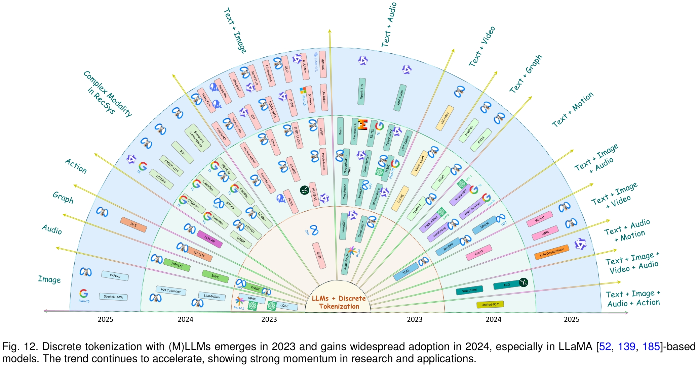
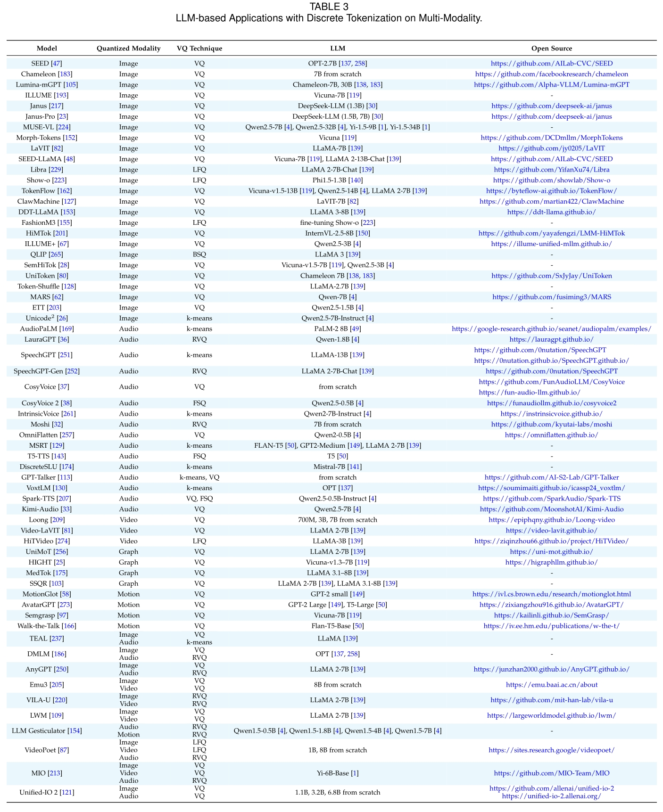

# Bridging Multiple Modality to LLMs: A Survey on Discrete Tokenization
The official GitHub page for the survey paper "Bridging Multiple Modality to LLMs: A Survey on Discrete Tokenization".

    <h1><b>Bridging Multiple Modality to LLMs: A Survey on Discrete Tokenization</b></h1>

The official GitHub page for the survey paper "Bridging Multiple Modality to LLMs: A Survey on Discrete Tokenization".

    

 
 

    

 
 

    

 
 

    

 
 

    

 
 

## 2 Fundamental Techniques

### 2.1

### 2.2

### 2.3

### 2.4

### 2.5

### 2.6

### 2.7

### 2.8

## 3 Classical Applications without LLMs

### 3.1

### 3.2

### 3.3

### 3.4

### 3.5

### 3.6

### 3.7

### 3.8

### 3.9

### 3.10

### 3.11

### 3.12

## 4 LLM-based Single-Modality Applications

### 4.1 

### 4.2

### 4.3

### 4.4

### 4.5

## 5 LLM based Multi-Modality Applications

### 5.1 

### 5.2

### 5.3

### 5.4

### 5.5

### 5.6

### 5.7

### 5.8

### 5.9

### 5.10

## 6 Challenges and Future Directions

## Related Survey

### non-LLM

### LLM

## Related Reposority

## 📖 Citation

