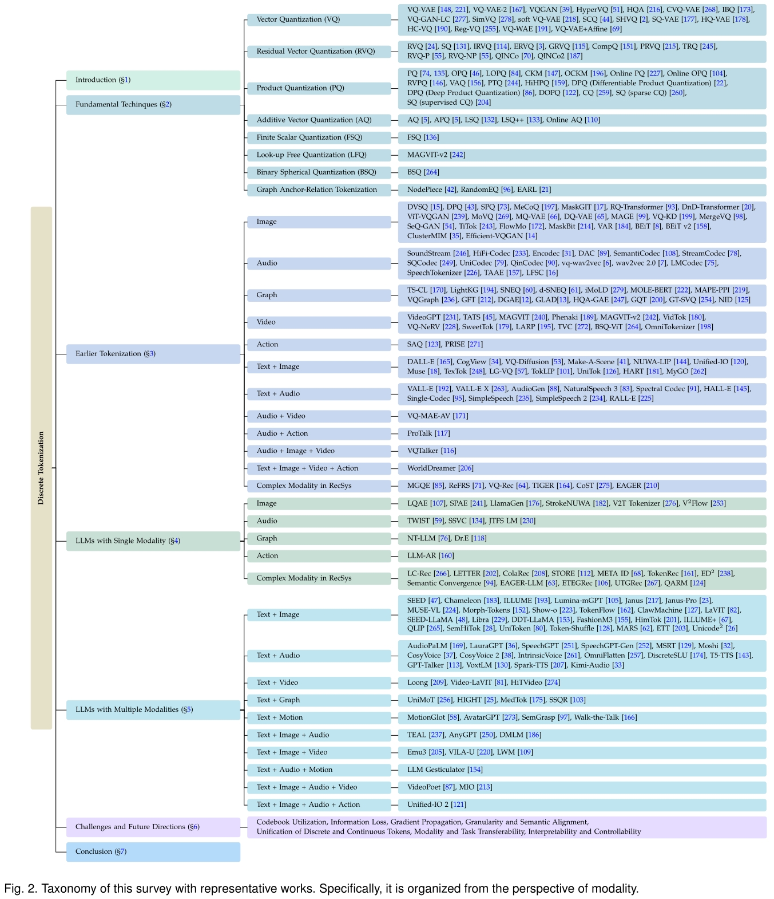
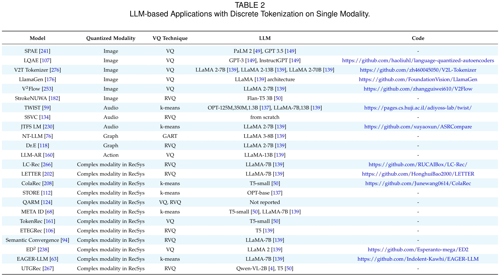

    <h1><b>Bridging Multiple Modality to LLMs: A Survey on Discrete Tokenization</b></h1>

The official GitHub page for the survey paper "Bridging Multiple Modality to LLMs: A Survey on Discrete Tokenization".

    

 
 

    

 
 

    

 
 

    

 
 

    

 
 

## 2 Fundamental Techniques

### 2.1 Vinalla Vector Quantization (VQ)

1. 2017_NeurIPS_VQ-VAE_Neural Discrete Representation Learning. [[arXiv]](https://arxiv.org/abs/1711.00937)

2. 2017_NeurlPS_SHVQ_Soft-to-Hard Vector Quantization for End-to-End Learning Compressible Representations. [[arXiv]](https://arxiv.org/abs/1704.00648)

3. 2018_arXiv_Theory and Experiments on Vector Quantized Autoencoders. [[arXiv]](https://arxiv.org/abs/1805.11063)

4. 2019_NeurlPS_VQ-VAE-2_Generating Diverse High-Fidelity Images with VQ-VAE-2. [[NeurIPS]](https://dl.acm.org/doi/10.5555/3454287.3455618) [[arXiv]](https://arxiv.org/abs/1906.00446)

5. 2020_AAAI_soft VQ-VAE_Vector quantization-based regularization for autoencoders. [[AAAI]](https://ojs.aaai.org/index.php/AAAI/article/view/6108) [[arXiv]](https://arxiv.org/abs/1905.11062)

6. 2020_NeurlPS_HQA_Hierarchical Quantized Autoencoders. [[NeurIPS]](https://proceedings.neurips.cc/paper/2020/hash/309fee4e541e51de2e41f21bebb342aa-Abstract.html) [[arXiv]](https://arxiv.org/abs/2002.08111)

7. 2021_CVPR_VQGAN_Taming Transformers for High-Resolution Image Synthesis. [[CVPR]](https://openaccess.thecvf.com/content/CVPR2021/papers/Esser_Taming_Transformers_for_High-Resolution_Image_Synthesis_CVPR_2021_paper.pdf)  [[arXiv]](https://arxiv.org/abs/2012.09841) [[Homepage]](https://compvis.github.io/taming-transformers/)

8. 2022_arXiv_HC-VQ_Homology-constrained vector quantization entropy regularizer. [[arXiv]](https://arxiv.org/abs/2211.14363)

9. 2022_ICML_SQ-VAE_SQ-VAE：Variational Bayes on Discrete Representation with Self-annealed Stochastic Quantization. [[ICML--Slides]](https://icml.cc/media/icml-2022/Slides/17788.pdf)  [[arXiv]](https://arxiv.org/abs/2205.07547)

10. 2023_CVPR_Reg-VQ_Regularized Vector Quantization for Tokenized Image Synthesis. [[CVPR]](https://openaccess.thecvf.com/content/CVPR2023/papers/Zhang_Regularized_Vector_Quantization_for_Tokenized_Image_Synthesis_CVPR_2023_paper.pdf) [[arXiv]](https://arxiv.org/abs/2303.06424)

11. 2023_ICCV_CVQ-VAE_Online Clustered Codebook. [[ICCV]](https://openaccess.thecvf.com/content/ICCV2023/papers/Zheng_Online_Clustered_Codebook_ICCV_2023_paper.pdf) [[arXiv]](https://arxiv.org/abs/2307.15139)

12. 2023_ICML_Straightening Out the Straight-Through Estimator：Overcoming Optimization Challenges in Vector Quantized Networks. [[ICML]](https://proceedings.mlr.press/v202/huh23a.html) [[arXiv]](https://arxiv.org/abs/2305.08842)

13. 2023_ICML_VQ-WAE_Vector Quantized Wasserstein Auto-Encoder. [[ICML]](https://proceedings.mlr.press/v202/vuong23a) [[arXiv]](https://arxiv.org/abs/2302.05917)

14. 2024_arXiv_HyperVQ_HyperVQ: MLR-based Vector Quantization in Hyperbolic Space. [[arXiv]](https://arxiv.org/abs/2403.13015)

15. 2024_arXiv_IBQ_Scalable Image Tokenization with Index Backpropagation Quantization. [[arXiv]](https://arxiv.org/abs/2412.02692)

16. 2024_arXiv_SimVQ_Addressing representation collapse in vector quantized models with one linear layer. [[arXiv]](https://arxiv.org/abs/2411.02038v1)

17. 2024_NeurIPS_VQGAN-LC_Scaling the Codebook Size of VQGAN to 100,000 with a Utilization Rate of 99%. [[arXiv]](https://arxiv.org/abs/2406.11837v1)

18. 2024_L4DC_SCQ_Soft Convex Quantization=Revisiting Vector Quantization with Convex Optimization. [[PMLR]](https://proceedings.mlr.press/v242/gautam24a/gautam24a.pdf) [[arXiv]](https://arxiv.org/abs/2310.03004)

19. 2024_TMLR_HQ-VAE_HQ-VAE：Hierarchical Discrete Representation Learning with Variational Bayes.  [[arXiv]](https://arxiv.org/abs/2401.00365)

20. 2025_ICLR_rotation trick_Restructuring vector quantization with the rotation trick. [[ICLR--Slides]](https://iclr.cc/media/iclr-2025/Slides/30284_p9wWGoU.pdf) [[arXiv]](https://arxiv.org/abs/2410.06424)

### 2.2 Residual Vector Quantization (RVQ)

1. 2010_Sensors_RVQ_Approximate nearest neighbor search by residual vector quantization. [[Sensors]](https://www.mdpi.com/1424-8220/10/12/11259)

2. 2014_arXiv_SQ_Stacked Quantizers for Compositional Vector Compression. [[arXiv]](https://arxiv.org/abs/1411.2173)

3. 2014_IEEE Multimedia_PRVQ_Projected residual vector quantization for ANN search. [[IEEE]](https://ieeexplore.ieee.org/document/6701297)

4. 2015_arXiv_IRVQ_Improved Residual Vector Quantization for High-dimensional Approximate Nearest Neighbor Search. [[arXiv]](https://arxiv.org/abs/1509.05195)

5. 2015_arXiv_TRQ_Transformed Residual Quantization for Approximate Nearest Neighbor Search. [[arXiv]](https://arxiv.org/abs/1512.06925)

6. 2016_Neurocomputing_RVQ-P RVQ-NP_Parametric and nonparametric residual vector quantization optimizations for ANN search. [[ACM]](https://dl.acm.org/doi/10.1016/j.neucom.2016.04.061)

7. 2016_TKDE_CompQ_Competitive Quantization for Approximate Nearest Neighbor Search. [[IEEE TKDE]](https://ieeexplore.ieee.org/document/7539664)

8. 2017_Multimedia Systems_ERVQ_Optimized residual vector quantization for efficient approximate nearest neighbor search. [[Springer]](https://link.springer.com/article/10.1007/s00530-015-0470-9)

9. 2017_Multimedia_GRVQ_Generalized Residual Vector Quantization and Aggregating Tree for Large Scale Search. [[IEEE Transactions on Multimedia]](https://ieeexplore.ieee.org/document/7894185)

10. 2024_ICML_QINCo_Residual Quantization with Implicit Neural Codebooks. [[ICML]](https://proceedings.mlr.press/v235/huijben24a.html) [[arXiv]](https://arxiv.org/abs/2401.14732)

11. 2025_arXiv_Qinco2_Qinco2：Vector Compression and Search with Improved Implicit Neural Codebooks. [[arXiv]](https://arxiv.org/abs/2501.03078)

### 2.3 Product Quantization (PQ)

1. 2011_TPAMI_PQ_Product Quantization for Nearest Neighbor Search. [[IEEE TPAMI]](https://ieeexplore.ieee.org/document/5432202)

2. 2013_CVPR_CKM_Cartesian k-means. [[CVPR]](https://www.cv-foundation.org/openaccess/content_cvpr_2013/html/Norouzi_Cartesian_K-Means_2013_CVPR_paper.html)

3. 2013_CVPR_OPQ_Optimized product quantization for approximate nearest neighbor search. [[IEEE CVPR]](https://ieeexplore.ieee.org/document/6619223) [[CVPR]](https://openaccess.thecvf.com/content_cvpr_2013/papers/Ge_Optimized_Product_Quantization_2013_CVPR_paper.pdf)

4. 2014_CVPR_LOPQ_Locally optimized product quantization for approximate nearest neighbor search. [[IEEE CVPR]](https://ieeexplore.ieee.org/document/6909695) [[CVPR]](https://openaccess.thecvf.com/content_cvpr_2014/papers/Kalantidis_Locally_Optimized_Product_2014_CVPR_paper.pdf)

5. 2014_ICML_CQ_Composite Quantization for Approximate Nearest Neighbor Search. [[ICML]](https://proceedings.mlr.press/v32/zhangd14)

6. 2015_CVPR_SQ1 SQ2_Sparse Composite Quantization. [[CVPR]](https://openaccess.thecvf.com/content_cvpr_2015/papers/Zhang_Sparse_Composite_Quantization_2015_CVPR_paper.pdf)

7. 2015_ICIP_PTQ_Product tree quantization for approximate nearest neighbor search. [[IEEE ICIP]](https://ieeexplore.ieee.org/document/7351158)

8. 2015_TKDE_OCKM_Optimized Cartesian K-Means. [[IEEE TKDE]](https://ieeexplore.ieee.org/document/6817617) [[arXiv]](https://arxiv.org/abs/1405.4054)

9. 2016_CVPR_SQ_Supervised Quantization for Similarity Search. [[CVPR]](https://www.cv-foundation.org/openaccess/content_cvpr_2016/papers/Wang_Supervised_Quantization_for_CVPR_2016_paper.pdf) [[arXiv]](https://arxiv.org/abs/1902.00617)

10. 2018_TKDE_Online PQ_Online Product Quantization. [[IEEE TKDE]](https://ieeexplore.ieee.org/document/8320306)

11. 2019_CVPR_DPQ_End-to-End Supervised Product Quantization for Image Search and Retrieval. [[IEEE CVPR]](https://ieeexplore.ieee.org/document/8953697) [[CVPR]](https://openaccess.thecvf.com/content_CVPR_2019/papers/Klein_End-To-End_Supervised_Product_Quantization_for_Image_Search_and_Retrieval_CVPR_2019_paper.pdf) [[arXiv]](https://arxiv.org/pdf/1711.08589)

12. 2020_ICDM_Online OPQ_Online Optimized Product Quantization. [[IEEE ICDM]](https://ieeexplore.ieee.org/document/9338380)

13. 2020_ICML_DPQ_Differentiable Product Quantization for End-to-End Embedding Compression. [[ICML]](https://proceedings.mlr.press/v119/chen20l.html) [[arXiv]](https://arxiv.org/abs/1908.09756)

14. 2022_ICDE_VAQ_Fast Adaptive Similarity Search through Variance-Aware Quantization. [[IEEE ICDE]](https://ieeexplore.ieee.org/document/9835314)

15. 2023_ESWA_RVPQ_Residual Vector Product Quantization for Approximate Nearest Neighbor Search. [[Springer]](https://link.springer.com/chapter/10.1007/978-3-031-05933-9_17)

16. 2023_WWW_DOPQ_Diferentiable Optimized Product Qantization and Beyond. [[WWW]](https://dl.acm.org/doi/10.1145/3543507.3583482)

17. 2024_AAAI_HiHPQ_HiHPQ: Hierarchical Hyperbolic Product Quantization for Unsupervised Image Retrieval. [[ACM AAAI]](https://dl.acm.org/doi/10.1609/aaai.v38i5.28261) [[arXiv]](https://arxiv.org/abs/2401.07212v1)

### 2.4 Additive Vector Quantzation (AQ)

1. 2014_CVPR_AQ_Additive Quantization for Extreme Vector Compression.

2. 2016_ECCV_LSQ_Revisiting Additive Quantization.

3. 2018_ECCV_LSQ++_LSQ++：Lower Running Time and Higher Recall in Multi-codebook Quantization.

4. 2021_KDD_Online AQ_Online Additive Quantization.

### 2.5 Finite Scalar Quantization (FSQ)

1. 2024_ICLR_FSQ_Finite Scalar Quantization= VQ-VAE Made Simple.

### 2.6 Look-up Free Quantization (LFQ)

1. 2024_ICLR_MAGVIT-v2_Language Model Beats Diffusion--Tokenizer is Key to Visual Generation.

### 2.7 Binary Spherical Quantization (BSQ)

1. 2025_ICLR_BSQ_Image and Video Tokenization with Binary Spherical Quantization.

### 2.8 Graph Anchor-Relation Compositional Tokenization

1. 2022_ICLR_NodePiece_NodePiece= Compositional and Parameter-Efficient Representations of Large Knowledge Graphs.

2. 2023_AAAI_EARL_Entity-Agnostic Representation Learning for Parameter-Efficient Knowledge Graph Embedding.

3. 2023_EMNLP_RandomEQ_Random Entity Quantization for Parameter-Efficient Compositional Knowledge Graph Representation.

## 3 Classical Applications without LLMs

### 3.1 Image

1. 2017_CVPR_DVSQ_Deep Visual-Semantic Quantization for Efficient Image Retrieval.

2. 2019_IJCAI_DPQ_Beyond product quantization：Deep progressive quantization for image retrieval.

3. 2021_ICCV_SPQ_Self-supervised Product Quantization for Deep Unsupervised Image Retrieval.

4. 2022_arXiv_BEiT v2_BEiT v2= Masked Image Modeling with Vector-Quantized Visual Tokenizers.

5. 2022_AAAI_MeCoQ_Contrastive Quantization with Code Memory for Unsupervised Image Retrieval.

6. 2022_CVPR_MaskGIT_MaskGIT：Masked Generative Image Transformer.

7. 2022_CVPR_RQ-VAE RQ-Transformer_AutoRegressive Image Generation using Residual Quantization.

8. 2022_ICLR_BEiT_BEiT= BERT Pre-Training of Image Transformers.

9. 2022_ICLR_ViT-VQGAN_Vector-Quantization Image Modeling with Improved VQGAN.

10. 2022_NeurlPS_MoVQ_MoVQ：Modulating Quantized Vectors for High-Fidelity Image Generation.

11. 2023_CVPR_DQ-VAE_Towards Accurate Image Coding：Improved Autoregressive Image Generation with Dynamic Vector Quantization.

12. 2023_CVPR_MAGE_MAGE：MAsked Generative Encoder to Unify Representation Learning and Image Synthesis.

13. 2023_CVPR_MQ-VAE_Not All Image Regions Matter：Masked Vector Quantization for Autoregressive Image Generation.

14. 2023_ICCV_Efficient-VQGAN_Efficient-VQGAN：Towards High-Resolution Image Generation with Efficient Vision Transformers.

15. 2024_CVPR_SeQ-GAN_Rethinking the Objectives of Vector-Quantized Tokenizers for Image Synthesis.

16. 2024_ICLR_ClusterMIM_On the Role of Discrete Tokenization in Visual Representation Learning.

17. 2024_NeurlPS_TiTok_An Image is Worth 32 Tokens for Reconstruction and Generation.

18. 2024_NeurlPS_VAR_Visual Autoregressive Modeling：Scalable Image Generation via Next-Scale Prediction.

19. 2024_NeurlPS_VQ-KD_Image Understanding Makes for A Good Tokenizer for Image Generation.

20. 2024_TMLR_MaskBit_MaskBit：Embedding-free Image Generation via Bit Tokens.

21. 2025_arXiv_FlowMo_Flow to the Mode= Mode-Seeking Diffusion Autoencoders for State-of-the-Art Image Tokenization.

22. 2025_CVPR_MergeVQ_MergeVQ：A Unified Framework for Visual Generation and Representation with Disentangled Token Merging and Quantization.

23. 2025_ICLR_DnD-Transformer_A spark of vision-language intelligence=2-dimensional autoregressive transformer for efficient finegrained image generation.

### 3.2 Sound

1. 2022_TASLP_SoundStream_SoundStream：An End-to-End Neural Audio Codec.

2. 2023_arXiv_HiFi-Codec_HiFi-Codec：Group-residual Vector quantization for High Fidelity Audio Codec.

3. 2023_NeurlPS_DAC_High fidelity neural audio compression with Improved RVQGAN.

4. 2023_TMLR_EnCodec_High Fidelity Neural Audio Compression.

5. 2024_J-STSP_SemantiCodec_SemantiCodec：An Ultra Low Bitrate Semantic Audio Codec for General Sound.

6. 2025_arXiv_QINCODEC_QINCODEC：Neural Audio Compression with Implicit Neural Codebooks.

7. 2025_arXiv_SQCodec_One Quantizer is Enough：Toward a Lightweight Audio Codec.

8. 2025_arXiv_UniCodec_UniCodec：Unified Audio Codec with Single Domain-Adaptive Codebook.

9. 2025_IEEE Signal Processing Letter_StreamCodec_A Streamable Neural Audio Codec with Residual Scalar-Vector Quantization for Real-Time Communication.

1. 2020_ICLR_vq-wav2vec_vq-wav2vec：Self-Supervised Learning of Discrete Speech Representations.

2. 2020_NeurlPS_wav2vec 2.0_wav2vec 2.0：A Framework for Self-Supervised Learning of Speech Representations.

3. 2023_ICASSP_LMCodec_LMCodec：A Low Bitrate Speech Codec with Causal Transformer Models.

4. 2024_ICLR_SpeechTokenizer_SpeechTokenizer：Unified Speech Tokenizer for Speech Language Models.

5. 2025_ICASSP_LFSC_Low Frame-rate Speech Codec=A Codec Designed for Fast High-quality Speech LLM Training and Inference.

6. 2025_ICLR_TAAE_Scaling Transformers for Low-Bitrate High-Quality Speech Coding.

### 3.3 Graph

1. 2020_AAAI_SNEQ_SNEQ= Semi-Supervised Attributed Network Embedding with Attention-Based Quantisation.

2. 2020_ACL_TS-CL_Knowledge Graph Embedding Compression.

3. 2021_CIKM_LightKG_A Lightweight Knowledge Graph Embedding Framework for Efficient Inference and Storage.

4. 2021_TNNLS_d-SNEQ_SemiSupervised Network Embedding with Differentiable Deep Quantization.

5. 2023_ICLR_Mole-BERT_Mole-BERT= Rethinking Pre-Training Graph Neural Networks for Molecules.

6. 2023_NeurIPS_IMoLD_Learning Invariant Molecular Representation in Latent Discrete Space.

7. 2024_ICLR_MAPE-PPI_MAPE-PPI：Towards Effective and Efficient Protein-Protein Interaction Prediction via Microenvironment-Aware Protein Embedding.

8. 2024_ICLR_VQGraph_VQGraph= Rethinking Graph Representation Space for Bridging GNNs and MLPs.

9. 2024_NeurlPS_GFT_GFT：Graph Foundation Model with Transferable Tree Vocabulary.

10. 2024_TMLR_DGAE_Discrete Graph Auto-Encoder.

11. 2025_arXiv_GT-SVQ_GT-SVQ：A Linear-Time Graph Transformer for Node Classification Using Spiking Vector Quantization.

12. 2025_AAAI_GLAD_GLAD= Improving Latent Graph Generative Modeling with Simple Quantization.

13. 2025_ICLR_GQT_Learning Graph Quantized Tokenizers.

14. 2025_ICLR_NID_Node Identifiers= Compact, Discrete Representations for Efficient Graph Learning.

15. 2025_WWW_HQA-GAE_Hierarchical Vector Quantized Graph Autoencoder with Annealing-Based Code Selection.

### 3.4 Video

1. 2021_arXiv_VideoGPT_VideoGPT：Video Generation using VQ-VAE and Transformers.

2. 2022_ECCV_TATS_Long Video Generation with Time-Agnostic VQGAN and Time-Sensitive Transformer.

3. 2023_CVPR_MAGVIT_MAGVIT= Masked Generative Video Transformer.

4. 2023_ICLR_Phenaki_Phenaki= Variable Length Video Generation From Open Domain Textual Descriptions.

5. 2024_arXiv_LARP_LARP：Tokenizing Videos with a Learned Autoregressive Generative Prior.

6. 2024_arXiv_VidTok_VidTok：A Versatile and Open-Source Video Tokenizer.

7. 2024_arXiv_VQ-NeRV_VQ-NeRV：A Vector Quantized Neural Representation for Videos.

8. 2024_ICLR_MAGVIT-v2_Language Model Beats Diffusion--Tokenizer is Key to Visual Generation.

9. 2024_NeurlPS_OmniTokenizer_OmniTokenizer：A Joint Image-Video Tokenizer for Visual Generation.

10. 2025_arXiv_SweetTok_SweetTok：Semantic-Aware Spatial-Temporal Tokenizer for Compact Visual Discretization.

11. 2025_arXiv_TVC_TVC：Tokenized Video Compression with Ultra-Low Bitrate.

12. 2025_ICLR_BSQ_Image and Video Tokenization with Binary Spherical Quantization.

### 3.5 Action

1. 2023_CoLR_SAQ_Action-Quantized Offline Reinforcement Learning for Robotic Skill Learning.

2. 2024_ICML_PRISE_PRISE=LLM-Style Sequence Compression for Learning Temporal Action Abstractions in Control.

### 3.6 Text + Image

1. 2021_ICML_DALL-E_Zero-Shot Text-to-Image Generation.

2. 2021_NeurIPS_CogView_CogView：Mastering Text-to-Image Generation via Transformers.

3. 2022_CVPR_VQ-Diffusion_Vector Quantized Diffusion Model for Text-to-Image Synthesis.

4. 2022_ECCV_Make-A-Scene_Make-A-Scene：Scene-Based Text-to-Image Generation with Human Priors.

5. 2023_CVPR_NUWA-LIP_NUWA-LIP：Language-guided Image Inpainting with Defect-free VQGAN.

6. 2023_ICLR_Unified-IO_A unified model for vision, language, and multi-modal tasks.

7. 2023_ICML_Muse_Muse=Text-to-Image Generation via Masked Generative Transformer.

8. 2024_arXiv_TexTok_Language-Guided Image Tokenization for Generation.

9. 2024_NeurlPS_LG-VQ_LG-VQ：Language-Guided Codebook Learning.

10. 2025_arXiv_TokLIP_TokLIP= Marry Visual Tokens to CLIP for Multimodal Comprehension and Generation.

11. 2025_arXiv_UniTok_UniTok：A Unified Tokenizer for Visual Generation and Understanding.

12. 2025_AAAI_MyGO_MyGO= Discrete Modality Information as Fine-Grained Tokens for Multi-modal Knowledge Graph Completion.

13. 2025_ICLR_HART_HART= Efficient Visual Generation with Hybrid Autoregressive Transformer.

### 3.7 Text + Sound

1. 2023_ICLR_AudioGen_AudioGen：Textually Guided Audio Generation.

2. 2024_arXiv_Spectral Codecs：Spectrogram-Based Audio Codecs for High Quality Speech Synthesis.

1. 2023_arXiv_VALL-E X_Speak Foreign Languages with Your Own Voice：Cross-Lingual Neural Codec Language Modeling.

2. 2023_arXiv_VALL-E_Neural Codec Language Models are Zero-Shot Text to Speech Synthesizers.

3. 2024_arXiv_RALL-E_RALL-E=Robust Codec Language Modeling with Chain-of-Thought Prompting for Text-to-Speech Synthesis.

4. 2024_arXiv_SimpleSpeech 2_SimpleSpeech 2：Towards Simple and Efficient Text-to-Speech with Flow-based Scalar Latent Transformer Diffusion Models.

5. 2024_ICML_NaturalSpeech 3_NaturalSpeech 3：Zero-Shot Speech Synthesis with Factorized Codec and Diffusion Models.

6. 2024_Interspeech_SimpleSpeech_SimpleSpeech：Towards Simple and Efficient Text-to-Speech with Scalar Latent Transformer Diffusion Models.

7. 2024_Interspeech_Single-Codec_Single-Codec=Single-Codebook Speech Codec towards High-Performance.

8. 2025_ICLR_HALL-E_HALL-E=Hierarchical Neural Codec Language Mdoel for Minute-Long Zero-Shot Text-to-Speech Synthesis.

### 3.8 Audio + Video

1. 2025_CVIU_VQ-MAE-AV_A vector quantized masked autoencoder for audiovisual speech emotion recognition.

### 3.9 Audio + Action

1. 2024_CVPR_ProTalk_Towards Variable and Coordinated Holistic Co-Speech Motion Generation.

### 3.10 Audio + Image + Video

1. 2025_AAAI_VQTalker_VQTalker：Towards Multilingual Talking Avatars through Facial Motion Tokenization.

### 3.11 Text + Image + Video + Action

1. 2024_arXiv_WorldDreamer_Dreamer=Towards General World Models for Video Generation via Predicting Masked Tokens.

### 3.12 Complex Modality in RecSys

1. 2020_WWW_MGQE_Learning Multi-granular Quantized Embeddings for Large-Vocab Categorical Features in Recommender Systems.

2. 2023_NeurlPS_TIGER_Recommender Systems with Generative Retrieval.

3. 2023_TOIS_ReFRS_ReFRS：Resource-efficient Federated Recommender System for Dynamic and Diversified User Preferences.

4. 2023_WWW_VQ-Rec_Learning Vector-Quantized Item Representation for Transferable Sequential Recommenders.

5. 2024_KDD_EAGER_EAGER：Two-Stream Generative Recommender with Behavior-Semantic Collaboration.

6. 2024_RecSys_CoST_CoST：Contrastive Quantization based Semantic Tokenization for Generative Recommendation.

## 4 LLM-based Single-Modality Applications

### 4.1 Image

1. 2023_NeurIPS_SPAE_SPAE：Semantic Pyramid AutoEncoder for Multimoda Generation with Frozen LLMs.

2. 2023_NeurlPS_LQAE_Language Quantized AutoEncoders：Towards Unsupervised Text-Image Alignment.

3. 2024_arXiv_LlamaGen_Autoregressive Model Beats Diffusion：Llama for Scalable Image Generation.

4. 2024_CVPR_V2T Tokenizer_Beyond Text：Frozen Large Language Models in Visual Signal Comprehension.

5. 2024_ICML_StrokeNUWA_StrokeNUWA=Tokenizing Strokes for Vector Graphic Synthesis.

6. 2025_arXiv_V2Flow_V2Flow：Unifying Visual Tokenization and Large Language Model Vocabularies for Autoregressive Image Generation.

### 4.2 Audio

1. 2023_NeurlPS_TWIST_Textually Pretrained Speech Language Models.

2. 2024_arXiv_JTFS LM_Comparing Discrete and Continuous Space LLMs for Speech Recognition.

3. 2024_arXiv_SSVC_Enhancing the Stability of LLM-based Speech Generation Systems through Self-Supervised Representations.

### 4.3 Graph

1. 2024_arXiv_NT-LLM_NT-LLM：A Novel Node Tokenizer for Integrating Graph Structure into Large Language Models.

2. 2025_AAAI_Dr.E_Multi-View Empowered Structural Graph Wordification for Language Models.

### 4.4 Action

1. 2024_CVPR_LLM-AR_LLMs are Good Action Recognizers.

### 4.5 Complex Modalityu in RecSys

1. 2024_arXiv_ETEGRec_Generative Recommender with End-to-End Learnable Item Tokenization.

2. 2024_arXiv_META ID_Improving LLMs for Recommendation with Out-Of-Vocabulary Tokens.

3. 2024_arXiv_QARM_QARM：Quantitative Alignment Multi-Modal Recommendation at Kuaishou.

4. 2024_arXiv_STORE_Streamlining Semantic Tokenization and Generative Recommendation with A Single LLM.

5. 2024_arXiv_TokenRec_TokenRec--Learning to Tokenize ID for LLM-bsed Generative Recommendations.

6. 2024_CIKM_ColaRec_Content-Based Collaborative Generation for Recommender Systems.

7. 2024_CIKM_LETTER_Learnable Item Tokenization for Generative Recommendation.

8. 2024_ICDE_LC-Rec_Adapting Large Language Models by Integrating Collaborative Semantics for Recommendation.

9. 2025_arXiv_UTGRec_Universal Item Tokenization for Transferable Generative Recommendation.

10. 2025_AAAI_Semantic Convergence：Harmonizing Recommender Systems via Two-Stage Alignment and Behavioral Semantic Tokenization.

11. 2025_WWW_EAGER-LLM_EAGER-LLM=Enhancing Large Language Models as Recommenders through Exogenous Behavior-Semantic Integration.

12. 2025_WWW_ED2_Unleash LLMs Potential for Sequential Recommendation by Coordinating Dual Dynamic Index Mechanism.

## 5 LLM based Multi-Modality Applications

### 5.1 Text + Image

1. 2023_arXiv_SEED_Planting a SEED of Vision in Large Language Model.

2. 2024_arXiv_Chameleon_Chameleon：Mixed-Modal Early-Fusion Foundation Models.

3. 2024_arXiv_ILLUME_ILLUME=Illuminating Your LLMs to See, Draw, and Self-Enhance.

4. 2024_arXiv_ILLUME_ILLUME=Illuminating Your LLMs to See, Draw, and Self-Enhance.

5. 2024_arXiv_Lumina-mGPT_Lumina-mGPT=Illuminate Flexible Photorealistic Text-to-Image Generation with Multimodal Generative Pretraining.

6. 2024_arXiv_MUSE-VL_MUSE-VL：Modeling Unified VLM through Semantic Discrete Encoding.

7. 2024_arXiv_Show-o_Show-o：One single transformer to unify multimodal understanding and generation.

8. 2024_ICLR_LaVIT_Unified Language-Vision Pretraining in LLM with Dynamic Discrete Visual Tokenization.

9. 2024_ICLR_SEED-LLaMA_Making LLaMA SEE and Draw with SEED Tokenizer.

10. 2024_ICML_Libra_Libra= Building Decoupled Vision System on Large Language Models.

11. 2024_ICML_Morph-Tokens_Auto-Encoding Morph-Tokens for Multimodal LLM.

12. 2025_arXiv_DDT-LLaMA_Generative Multimodal Pretraining with Discrete Diffusion Timestep Tokens.

13. 2025_arXiv_ETT_End-to-End-Vision Tokenizer Tuning.

14. 2025_arXiv_FashionM3_FashionM3=Multimodal, Multitask, and Multiround Fashion Assistant based on Unified Vision-Language Model.

15. 2025_arXiv_HiMTok_HiMTok：Learning Hierarchical Mask Tokens for Image Segmentation with Large Multimodal Model.

16. 2025_arXiv_ILLUME+_ILLUME+：Illuminating Unified MLLM with Dual Visual Tokenization and Diffusion Refinement.

17. 2025_arXiv_Janus-Pro_Janus-Pro=Unified Multimodal Understanding and Generation with Data and Model Scaling.

18. 2025_arXiv_QLIP_QLIP：Text-Aligned Visual Tokenization Unifies Auto-Regressive Multimodal Understanding and Generation.

19. 2025_arXiv_SemHiTok_SemHiTok：A Unified Image Tokenizer via Semantic-Guided Hierarchical Codebook for Multimodal Understanding and Generation.

20. 2025_arXiv_UniToken_UniToken：Harmonizing Multimodal Understanding and Generation through Unified Visual Encoding.

21. 2025_arXv_Token-Shuffle_Token-Shuffle：Towards High-Resolution Image Generation with Autoregressive Models.

22. 2025_AAAI_MARS_MARS=Mixture of Auto-Regressive Models for Fine-grained Text-to-image Synthesis.

23. 2025_CVPR_TokenFlow_TokenFlow：Unified Image Tokenizer for Multimodal Understanding and Generation.

24. 2025_ICLR_ClawMachine_ClawMachine=Fetching Visual Tokens as An Entity for Referring and Grounding.

### 5.2 Text + Audio

1. 2023_arXiv_AudioPaLM_AudioPaLM=A Large Language Model That Can Speak and Listen.

2. 2023_arXiv_LauraGPT_LauraGPT=Listen, Attend, Understand, and Regenerate Audio with GPT.

3. 2023_EMNLP_SpeechGPT_SpeechGPT=Empowering Large Language Models with Intrinsic Cross-Modal Conversational Abilities.

4. 2024_arXiv_CosyVoice 2_CosyVoice 2=Scalable Streaming Speech Synthesis with Large Language Models.

5. 2024_arXiv_CosyVoice_CosyVoice_A Scalable Multilingual Zero-shot Text-to-Speech Synthesizer based on Supervised Semantic Tokens.

6. 2024_arXiv_IntrinsicVoice_IntrinsicVoice=Empowering LLMs with Intrinsic Real-time Voice Interaction Abilities.

7. 2024_arXiv_Moshi_Moshi：a speech-text foundation model for real-time dialogue.

8. 2024_arXiv_OmniFlatten_OmniFlatten=An End-to-end GPT Model for Seamless Voice Conversation.

9. 2024_arXiv_T5-TTS_Improving Robustness of LLM-based Speech Synthesis by Learning Monotonic Alignment.

10. 2024_ICASSP_VoxtLM_VoxtLM=Unified Decoder-Only Models for Consolidating Speech Recognition, Synthesis and Speech, Text Continuation Tasks.

11. 2024_IEEE Signal Processing Letters_MSRT_Tuning Large Language Model for Speech Recognition With Mixed-Scale Re-Tokenization.

12. 2024_Interspeech_DiscreteSLU_DiscreteSLU= A Large Language Model with Self-Supervised Discrete Speech Units for Spoken Language Understanding.

13. 2024_MM_GPT-Talker_Generative Expressive Conversational Speech Synthesis.

14. 2025_arXiv_Spark-TTS_Spark-TTS：An Efficient LLM-Based Text-to-Speech Model with Single-Stream Decoupled Speech Tokens.

15. 2025_Kimi-Audio_Kimi-Audio Technical Report.

### 5.3 Text + Video

1. 2024_arXiv_Loong_Loong=Generating Minute-level Long Videos with Autoregressive Language Models.

2. 2024_ICML_Video-LaVIT_Video-LaVIT=Unified Video-Language Pre-training with Decoupled Visual-Motional Tokenization.

3. 2025_arXiv_HiTVideo_HiTVideo=Hierarchical Tokenizers for Enhancing Text-to-Video Generation with Autoregressive Large Language Models.

### 5.4 Text + Graph

1. 2024_arXiv_UniMoT_UniMoT_Unified Molecule-Text Language Model with Discrete Token Representation.

2. 2024_ICML Workshop_HIGHT_Improving Graph-Language Alignment with Hierarchical Graph Tokenization.

3. 2025_arXiv_MedTok_Multimodal Medical Code Tokenizer.

4. 2025_arXiv_SSQR_Self-Supervised Quantized Representation for Seamlessly Integrating Knowledge Graphs with Large Language Models.

### 5.5 Text + Motion

1. 2024_arXiv_MotionGlot_MotionGlot=A Multi-Embodied Motion Generation Model.

2. 2024_CVPR_AvatarGPT_AvatarGPT=All-in-One Framework for Motion Understanding, Planning, Generation and Beyond.

3. 2024_ECCV_Semgrasp_Semantic grasp generation via language aligned discretization.

4. 2024_IV_Walk-the-Talk_Walk-the-Talk=LLM driven Pedestrian Motion Generation.

### 5.6 Text + Image + Audio

1. 2023_arXiv_TEAL_TEAL=Tokenize and Embed ALL for Multi-modal Large Language Models.

2. 2024_arXiv_DMLM_Discrete Multimodal Transformers with A Pretrained Large Language Model for Mixed-Supervision Speech Processing.

3. 2024_ACL_AnyGPT_AnyGPT= Unified Multimodal LLM with Discrete Sequence Modeling.

### 5.7 Text + Image + Video

1. 2024_arXiv_Emu3：Next-Token Prediction is All You Need.

2. 2025_ICLR_LWM_World model on million-length video and language with blockwise ringattention.

3. 2025_ICLR_VILA-U_VILA-U= A Unified Foundation Model Integrating Visual Understanding and Generation.

### 5.8 Text + Audio + Motion

1. 2025_ICCGV_LLM Gesticulator_LLM Gesticulator=Levaraging Large Language Models for Scalable and Controllable Co-Speech Gesture Synthesis.

### 5.9 Text + Image + Audio + Action

1. 2024_CVPR_Unified-IO 2_Unified-IO 2：Scaling Autoregressive Multimodal Models with Vision, Language, Audio, and Action.

### 5.10 Text + Image + Video + Audio

1. 2024_arXiv_MIO_MIO=A foundation model on multimodal tokens.

2. 2024_ICML_VideoPoet_VideoPoet= A Large Language Model for Zero-Shot Video Generation.

## 6 Challenges and Future Directions

## Related Survey

1. 1988_IEEE Transactions on Communications_Survey_Image Coding Using Vector Quantization：A Review.

2. 1989_IEEE Transactions on Information Theory_Survey_High-Resolution Quantization Theory and the Vector Quantizer Advantage.

3. 1990_IEEE Transactions on Information Theory_Survey_A Study of Vector Quantization for Noisy Channels.

4. 1996_TIP_Survey_Advances in Residual Vector Quantization：A  Review.

5. 1998_IEEE transactions on information theory_Survey_Quantization.

6. 2006_IEEE Potentials_Survey_A review of vector quantization techniques.

7. 2010_IHMSP_Survey_A Survey of VQ Codebook Generation.

8. 2018_MTA_Survey_A Survey of Product Quantization.

9. 2019_Frontiers of Information Technology & Electronic Engineering_Survey_Vector quantization：a review.

10. 2023_ACM Computing Surveys_Survey_Embedding in Recommender Systems：A Survey.

11. 2024_arXiv_Survey_Vector quantization for recommender systems：a review and outlook.

12. 2024_ACM Computing Surveys_Survey_Embedding Compression in Recommender Systems：A Survey.

13. 2024_Data Engineering_Survey_High-Dimensional Vector Quantization：General Framework, Recent Advances, and Future Directions.

14. 2024_arXIv_Survey_Next Token Prediction Towards Multimodal Intelligence：A Comprehensive Survey.

15. 2024_PrePrints_Survey_Continuous or Discrete, That is the Question=A Survey on Large Multi-Modal Models from the Perspective of Input-Output Space Extension.

16. 2025_arXiv_Survey_A Survey of Quantized Graph Representation Learning= Connecting Graph Structures with Large Language Models.

17. 2025_arXiv_Survey_From Principles to Applications= A Comprehensive Survey of Discrete Tokenizers in Generation, Comprehension, Recommendation, and Information Retrieval.

18. 2025_arXiv_Survey_Recent Advances in Discrete Speech Tokens：A Review.

19. 2025_TMLR_Survey_Autoregressive Models in Vision：A Survey.

## Related Reposority

## 📖 Citation

