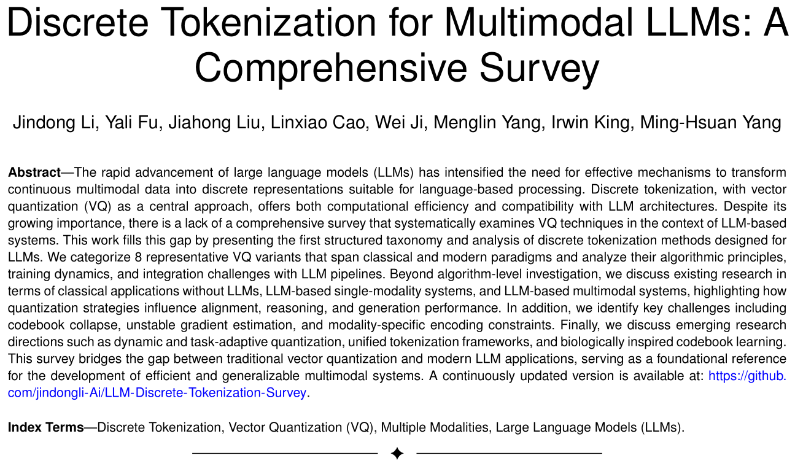
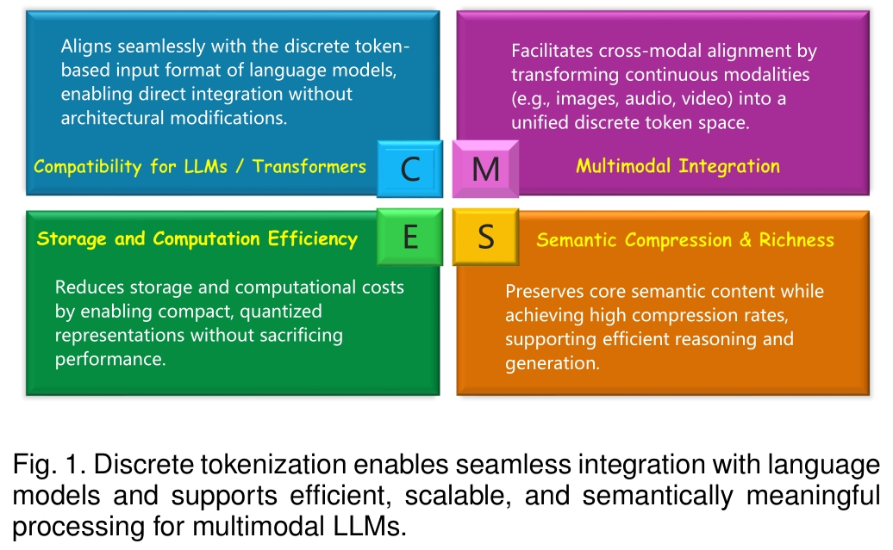
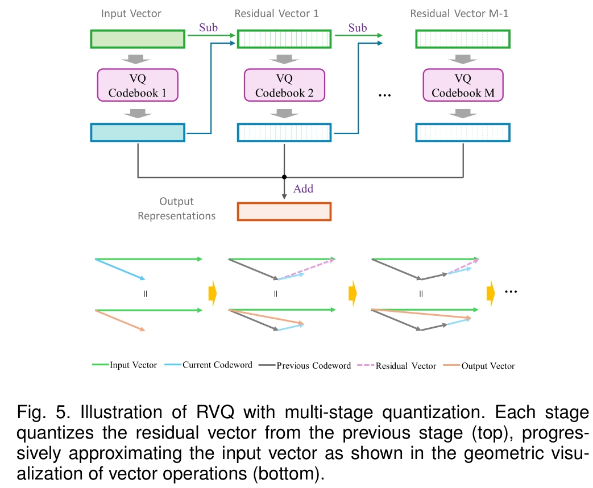
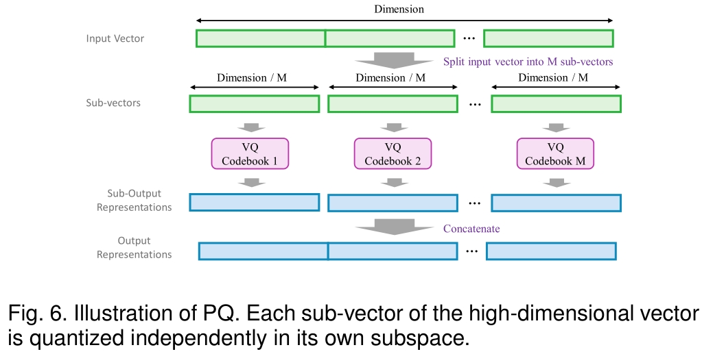
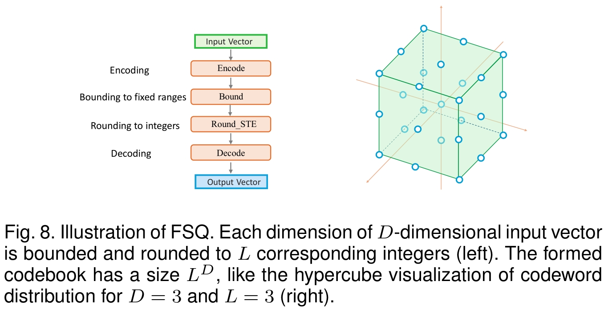
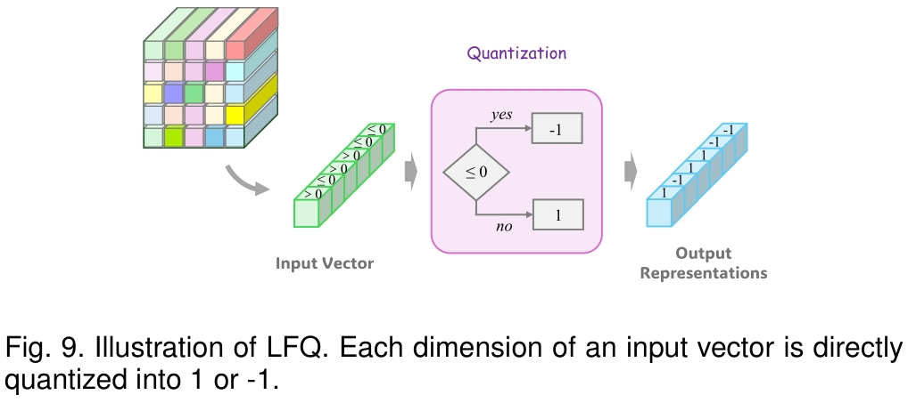
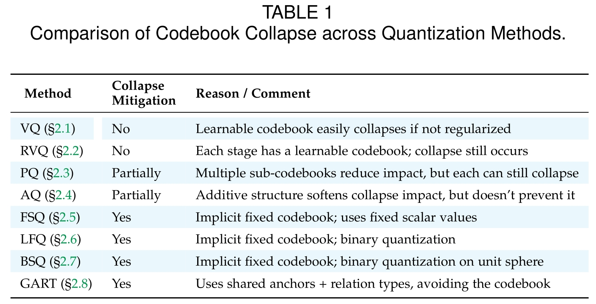
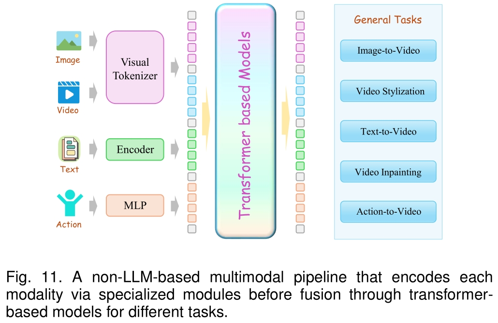
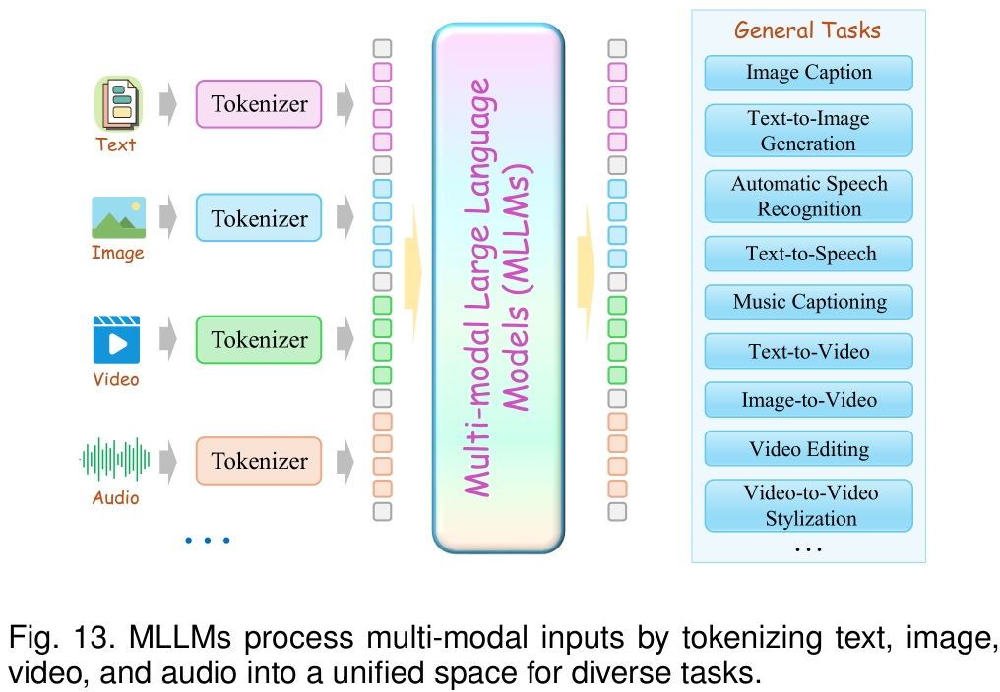

    <h1><b>Discrete Tokenization for Multimodal LLMs: A Comprehensive Survey</b></h1>

The official GitHub page for the survey paper "Discrete Tokenization for Multimodal LLMs: A Comprehensive Survey".

    [arXiv][https://arxiv.org/abs/2507.22920]

 

    

 
 

    

 
 

    

 
 

    

 
 

    

 
 

    

 
 

## 2 Fundamental Techniques

    

    

### 2.1 Vinalla Vector Quantization (VQ)

1. 2017_NeurIPS_VQ-VAE_Neural Discrete Representation Learning.
   [[arXiv]](https://arxiv.org/abs/1711.00937)

2. 2017_NeurlPS_SHVQ_Soft-to-Hard Vector Quantization for End-to-End Learning Compressible Representations.
   [[arXiv]](https://arxiv.org/abs/1704.00648)

3. 2018_arXiv_Theory and Experiments on Vector Quantized Autoencoders.
   [[arXiv]](https://arxiv.org/abs/1805.11063)

4. 2019_NeurlPS_VQ-VAE-2_Generating Diverse High-Fidelity Images with VQ-VAE-2.
   [[NeurIPS]](https://dl.acm.org/doi/10.5555/3454287.3455618)
   [[arXiv]](https://arxiv.org/abs/1906.00446)

5. 2020_AAAI_soft VQ-VAE_Vector quantization-based regularization for autoencoders.
   [[AAAI]](https://ojs.aaai.org/index.php/AAAI/article/view/6108)
   [[arXiv]](https://arxiv.org/abs/1905.11062)

6. 2020_NeurlPS_HQA_Hierarchical Quantized Autoencoders.
    [[NeurIPS]](https://proceedings.neurips.cc/paper/2020/hash/309fee4e541e51de2e41f21bebb342aa-Abstract.html)
    [[arXiv]](https://arxiv.org/abs/2002.08111)

7. 2021_CVPR_VQGAN_Taming Transformers for High-Resolution Image Synthesis.
    [[CVPR]](https://openaccess.thecvf.com/content/CVPR2021/papers/Esser_Taming_Transformers_for_High-Resolution_Image_Synthesis_CVPR_2021_paper.pdf)
    [[arXiv]](https://arxiv.org/abs/2012.09841)
    [[Homepage]](https://compvis.github.io/taming-transformers/)

8. 2022_arXiv_HC-VQ_Homology-constrained vector quantization entropy regularizer.
    [[arXiv]](https://arxiv.org/abs/2211.14363)

9. 2022_ICML_SQ-VAE_SQ-VAE:Variational Bayes on Discrete Representation with Self-annealed Stochastic Quantization.
    [[ICML--Slides]](https://icml.cc/media/icml-2022/Slides/17788.pdf)
    [[arXiv]](https://arxiv.org/abs/2205.07547)

10. 2023_CVPR_Reg-VQ_Regularized Vector Quantization for Tokenized Image Synthesis.
    [[CVPR]](https://openaccess.thecvf.com/content/CVPR2023/papers/Zhang_Regularized_Vector_Quantization_for_Tokenized_Image_Synthesis_CVPR_2023_paper.pdf)
    [[arXiv]](https://arxiv.org/abs/2303.06424)

11. 2023_ICCV_CVQ-VAE_Online Clustered Codebook.
    [[ICCV]](https://openaccess.thecvf.com/content/ICCV2023/papers/Zheng_Online_Clustered_Codebook_ICCV_2023_paper.pdf)
    [[arXiv]](https://arxiv.org/abs/2307.15139)

12. 2023_ICML_Straightening Out the Straight-Through Estimator:Overcoming Optimization Challenges in Vector Quantized Networks.
    [[ICML]](https://proceedings.mlr.press/v202/huh23a.html)
    [[arXiv]](https://arxiv.org/abs/2305.08842)

13. 2023_ICML_VQ-WAE_Vector Quantized Wasserstein Auto-Encoder.
    [[ICML]](https://proceedings.mlr.press/v202/vuong23a)
    [[arXiv]](https://arxiv.org/abs/2302.05917)

14. 2024_arXiv_HyperVQ_HyperVQ: MLR-based Vector Quantization in Hyperbolic Space.
    [[arXiv]](https://arxiv.org/abs/2403.13015)

15. 2024_arXiv_IBQ_Scalable Image Tokenization with Index Backpropagation Quantization.
    [[arXiv]](https://arxiv.org/abs/2412.02692)

16. 2024_arXiv_SimVQ_Addressing representation collapse in vector quantized models with one linear layer.
    [[arXiv]](https://arxiv.org/abs/2411.02038v1)

17. 2024_NeurIPS_VQGAN-LC_Scaling the Codebook Size of VQGAN to 100,000 with a Utilization Rate of 99%.
    [[arXiv]](https://arxiv.org/abs/2406.11837v1)

18. 2024_L4DC_SCQ_Soft Convex Quantization=Revisiting Vector Quantization with Convex Optimization.
    [[PMLR]](https://proceedings.mlr.press/v242/gautam24a/gautam24a.pdf)
    [[arXiv]](https://arxiv.org/abs/2310.03004)

19. 2024_TMLR_HQ-VAE_HQ-VAE:Hierarchical Discrete Representation Learning with Variational Bayes.
    [[arXiv]](https://arxiv.org/abs/2401.00365)

20. 2025_ICLR_rotation trick_Restructuring vector quantization with the rotation trick.
    [[ICLR--Slides]](https://iclr.cc/media/iclr-2025/Slides/30284_p9wWGoU.pdf)
    [[arXiv]](https://arxiv.org/abs/2410.06424)

### 2.2 Residual Vector Quantization (RVQ)

    

1. 2010_Sensors_RVQ_Approximate nearest neighbor search by residual vector quantization.
   [[Sensors]](https://www.mdpi.com/1424-8220/10/12/11259)

2. 2014_arXiv_SQ_Stacked Quantizers for Compositional Vector Compression.
   [[arXiv]](https://arxiv.org/abs/1411.2173)

3. 2014_IEEE Multimedia_PRVQ_Projected residual vector quantization for ANN search.
   [[IEEE]](https://ieeexplore.ieee.org/document/6701297)

4. 2015_arXiv_IRVQ_Improved Residual Vector Quantization for High-dimensional Approximate Nearest Neighbor Search.
   [[arXiv]](https://arxiv.org/abs/1509.05195)

5. 2015_arXiv_TRQ_Transformed Residual Quantization for Approximate Nearest Neighbor Search.
    [[arXiv]](https://arxiv.org/abs/1512.06925)

6. 2016_Neurocomputing_RVQ-P RVQ-NP_Parametric and nonparametric residual vector quantization optimizations for ANN search.
    [[ACM]](https://dl.acm.org/doi/10.1016/j.neucom.2016.04.061)

7. 2016_TKDE_CompQ_Competitive Quantization for Approximate Nearest Neighbor Search.
    [[IEEE TKDE]](https://ieeexplore.ieee.org/document/7539664)

8. 2017_Multimedia Systems_ERVQ_Optimized residual vector quantization for efficient approximate nearest neighbor search.
    [[Springer]](https://link.springer.com/article/10.1007/s00530-015-0470-9)

9. 2017_Multimedia_GRVQ_Generalized Residual Vector Quantization and Aggregating Tree for Large Scale Search.
    [[IEEE Transactions on Multimedia]](https://ieeexplore.ieee.org/document/7894185)

10. 2024_ICML_QINCo_Residual Quantization with Implicit Neural Codebooks. [[ICML]](https://proceedings.mlr.press/v235/huijben24a.html)
    [[arXiv]](https://arxiv.org/abs/2401.14732)

11. 2025_arXiv_Qinco2_Qinco2:Vector Compression and Search with Improved Implicit Neural Codebooks.
    [[arXiv]](https://arxiv.org/abs/2501.03078)

### 2.3 Product Quantization (PQ)

    

1. 2011_TPAMI_PQ_Product Quantization for Nearest Neighbor Search.
   [[IEEE TPAMI]](https://ieeexplore.ieee.org/document/5432202)

2. 2013_CVPR_CKM_Cartesian k-means.
   [[CVPR]](https://www.cv-foundation.org/openaccess/content_cvpr_2013/html/Norouzi_Cartesian_K-Means_2013_CVPR_paper.html)

3. 2013_CVPR_OPQ_Optimized product quantization for approximate nearest neighbor search.
   [[IEEE CVPR]](https://ieeexplore.ieee.org/document/6619223)
   [[CVPR]](https://openaccess.thecvf.com/content_cvpr_2013/papers/Ge_Optimized_Product_Quantization_2013_CVPR_paper.pdf)

4. 2014_CVPR_LOPQ_Locally optimized product quantization for approximate nearest neighbor search.
   [[IEEE CVPR]](https://ieeexplore.ieee.org/document/6909695)
   [[CVPR]](https://openaccess.thecvf.com/content_cvpr_2014/papers/Kalantidis_Locally_Optimized_Product_2014_CVPR_paper.pdf)

5. 2014_ICML_CQ_Composite Quantization for Approximate Nearest Neighbor Search.
    [[ICML]](https://proceedings.mlr.press/v32/zhangd14)

6. 2015_CVPR_SQ1 SQ2_Sparse Composite Quantization.
    [[CVPR]](https://openaccess.thecvf.com/content_cvpr_2015/papers/Zhang_Sparse_Composite_Quantization_2015_CVPR_paper.pdf)

7. 2015_ICIP_PTQ_Product tree quantization for approximate nearest neighbor search.
    [[IEEE ICIP]](https://ieeexplore.ieee.org/document/7351158)

8. 2015_TKDE_OCKM_Optimized Cartesian K-Means.
    [[IEEE TKDE]](https://ieeexplore.ieee.org/document/6817617)
    [[arXiv]](https://arxiv.org/abs/1405.4054)

9. 2016_CVPR_SQ_Supervised Quantization for Similarity Search.
    [[CVPR]](https://www.cv-foundation.org/openaccess/content_cvpr_2016/papers/Wang_Supervised_Quantization_for_CVPR_2016_paper.pdf)
    [[arXiv]](https://arxiv.org/abs/1902.00617)

10. 2018_TKDE_Online PQ_Online Product Quantization.
    [[IEEE TKDE]](https://ieeexplore.ieee.org/document/8320306)

11. 2019_CVPR_DPQ_End-to-End Supervised Product Quantization for Image Search and Retrieval.
    [[IEEE CVPR]](https://ieeexplore.ieee.org/document/8953697)
    [[CVPR]](https://openaccess.thecvf.com/content_CVPR_2019/papers/Klein_End-To-End_Supervised_Product_Quantization_for_Image_Search_and_Retrieval_CVPR_2019_paper.pdf)
    [[arXiv]](https://arxiv.org/pdf/1711.08589)

12. 2020_ICDM_Online OPQ_Online Optimized Product Quantization.
    [[IEEE ICDM]](https://ieeexplore.ieee.org/document/9338380)

13. 2020_ICML_DPQ_Differentiable Product Quantization for End-to-End Embedding Compression.
    [[ICML]](https://proceedings.mlr.press/v119/chen20l.html)
    [[arXiv]](https://arxiv.org/abs/1908.09756)

14. 2022_ICDE_VAQ_Fast Adaptive Similarity Search through Variance-Aware Quantization.
    [[IEEE ICDE]](https://ieeexplore.ieee.org/document/9835314)

15. 2023_ESWA_RVPQ_Residual Vector Product Quantization for Approximate Nearest Neighbor Search.
    [[Springer]](https://link.springer.com/chapter/10.1007/978-3-031-05933-9_17)

16. 2023_WWW_DOPQ_Diferentiable Optimized Product Qantization and Beyond.
    [[WWW]](https://dl.acm.org/doi/10.1145/3543507.3583482)

17. 2024_AAAI_HiHPQ_HiHPQ: Hierarchical Hyperbolic Product Quantization for Unsupervised Image Retrieval.
    [[ACM AAAI]](https://dl.acm.org/doi/10.1609/aaai.v38i5.28261)
    [[arXiv]](https://arxiv.org/abs/2401.07212v1)

### 2.4 Additive Vector Quantzation (AQ)

    

1. 2014_CVPR_AQ_Additive Quantization for Extreme Vector Compression.
   [[IEEE CVPR]](https://ieeexplore.ieee.org/document/6909519)
   [[CVPR]](https://openaccess.thecvf.com/content_cvpr_2014/html/Babenko_Additive_Quantization_for_2014_CVPR_paper.html)

2. 2016_ECCV_LSQ_Revisiting Additive Quantization.
   [[Springer]](https://link.springer.com/chapter/10.1007/978-3-319-46475-6_9)
   [[ECCV]](https://una-dinosauria.github.io/papers/eccv16.pdf)

3. 2018_ECCV_LSQ++_LSQ++: Lower Running Time and Higher Recall in Multi-codebook Quantization.
   [[ECCV]](https://openaccess.thecvf.com/content_ECCV_2018/papers/Julieta_Martinez_LSQ_lower_runtime_ECCV_2018_paper.pdf)

4. 2021_KDD_Online AQ_Online Additive Quantization.
   [[ACM KDD]](https://dl.acm.org/doi/10.1145/3447548.3467441)
   [[KDD]](http://dm.ustc.edu.cn/paper_pdf/2021/Qi-Liu-KDD.pdf#:~:text=To%20this%20end%2C%20we%20propose%20an%20online%20learning,%28optimized%29%20prod-uct%20quantization%20and%20comparably%20to%20composite%20quantization.)

### 2.5 Finite Scalar Quantization (FSQ)

    

1. 2024_ICLR_FSQ_Finite Scalar Quantization: VQ-VAE Made Simple. [
   [ICLR]](https://iclr.cc/virtual/2024/poster/19317)
   [[arXiv]](https://arxiv.org/abs/2309.15505)

### 2.6 Look-up Free Quantization (LFQ)

    

1. 2024_ICLR_MAGVIT-v2_Language Model Beats Diffusion--Tokenizer is Key to Visual Generation.
   [[ICLR]](https://iclr.cc/virtual/2024/poster/18119)
   [[arXiv]](https://arxiv.org/abs/2310.05737)

### 2.7 Binary Spherical Quantization (BSQ)

    

1. 2025_ICLR_BSQ_Image and Video Tokenization with Binary Spherical Quantization.
   [[arXiv]](https://arxiv.org/abs/2406.07548)

### 2.8 Graph Anchor-Relation Compositional Tokenization

1. 2022_ICLR_NodePiece_NodePiece: Compositional and Parameter-Efficient Representations of Large Knowledge Graphs.
   [[ICLR]](https://iclr.cc/virtual/2022/poster/6306)
   [[arXiv]](https://arxiv.org/abs/2106.12144)

2. 2023_AAAI_EARL_Entity-Agnostic Representation Learning for Parameter-Efficient Knowledge Graph Embedding.
   [[ACM AAAI]](https://dl.acm.org/doi/abs/10.1609/aaai.v37i4.25535)
   [[arXiv]](https://arxiv.org/abs/2302.01849)

3. 2023_EMNLP_RandomEQ_Random Entity Quantization for Parameter-Efficient Compositional Knowledge Graph Representation.
   [[EMNLP]](https://aclanthology.org/2023.emnlp-main.177/)
   [[arXiv]](https://arxiv.org/abs/2310.15797)

    

## 3 Classical Applications without LLMs

### 3.1 Image

1. 2017_CVPR_DVSQ_Deep Visual-Semantic Quantization for Efficient Image Retrieval.
   [[CVPR]](https://openaccess.thecvf.com/content_cvpr_2017/html/Cao_Deep_Visual-Semantic_Quantization_CVPR_2017_paper.html)

2. 2019_IJCAI_DPQ_Beyond product quantization:Deep progressive quantization for image retrieval.
   [[IJCAI]](https://dl.acm.org/doi/10.5555/3367032.3367136)
   [[arXiv]](https://arxiv.org/abs/1906.06698)

3. 2021_ICCV_SPQ_Self-supervised Product Quantization for Deep Unsupervised Image Retrieval.
   [[ICCV]](https://openaccess.thecvf.com/content/ICCV2021/papers/Jang_Self-Supervised_Product_Quantization_for_Deep_Unsupervised_Image_Retrieval_ICCV_2021_paper.pdf)
   [[arXiv]](https://arxiv.org/abs/2109.02244)

4. 2022_arXiv_BEiT v2_BEiT v2: Masked Image Modeling with Vector-Quantized Visual Tokenizers.
   [[arXiv]](https://arxiv.org/abs/2208.06366)

5. 2022_AAAI_MeCoQ_Contrastive Quantization with Code Memory for Unsupervised Image Retrieval.
    [[AAAI]](https://aaai.org/papers/02468-contrastive-quantization-with-code-memory-for-unsupervised-image-retrieval/)
    [[arXiv]](https://arxiv.org/abs/2109.05205)

6. 2022_CVPR_MaskGIT_MaskGIT:Masked Generative Image Transformer.
    [[CVPR]](https://openaccess.thecvf.com/content/CVPR2022/papers/Chang_MaskGIT_Masked_Generative_Image_Transformer_CVPR_2022_paper.pdf)
    [[arXiv]](https://arxiv.org/abs/2202.04200)
    [[Github]](https://github.com/google-research/maskgit)

7. 2022_CVPR_RQ-VAE RQ-Transformer_AutoRegressive Image Generation using Residual Quantization.
    [[CVPR]](https://openaccess.thecvf.com/content/CVPR2022/html/Lee_Autoregressive_Image_Generation_Using_Residual_Quantization_CVPR_2022_paper.html)
    [[arXiv]](https://arxiv.org/abs/2203.01941)

8. 2022_ICLR_BEiT_BEiT: BERT Pre-Training of Image Transformers.
    [[ICLR]](https://iclr.cc/virtual/2022/oral/6324)
    [[arXiv]](https://arxiv.org/abs/2106.08254)

9. 2022_ICLR_ViT-VQGAN_Vector-Quantization Image Modeling with Improved VQGAN.
    [[ICLR]](https://iclr.cc/virtual/2022/poster/6405)
    [[arXiv]](https://arxiv.org/abs/2110.04627)

10. 2022_NeurlPS_MoVQ_MoVQ: Modulating Quantized Vectors for High-Fidelity Image Generation.
    [[NeurIPS]](https://neurips.cc/virtual/2022/poster/55365)
    [[arXiv]](https://arxiv.org/abs/2209.09002)

11. 2023_CVPR_DQ-VAE_Towards Accurate Image Coding:Improved Autoregressive Image Generation with Dynamic Vector Quantization.
    [[CVPR]](https://openaccess.thecvf.com/content/CVPR2023/papers/Huang_Towards_Accurate_Image_Coding_Improved_Autoregressive_Image_Generation_With_Dynamic_CVPR_2023_paper.pdf)
    [[arXiv]](https://arxiv.org/abs/2305.11718)

12. 2023_CVPR_MAGE_MAGE: MAsked Generative Encoder to Unify Representation Learning and Image Synthesis.
    [[CVPR]](https://openaccess.thecvf.com/content/CVPR2023/papers/Li_MAGE_MAsked_Generative_Encoder_To_Unify_Representation_Learning_and_Image_CVPR_2023_paper.pdf)
    [[arXiv]](https://arxiv.org/abs/2211.09117)
    [[Github]](https://github.com/LTH14/mage)

13. 2023_CVPR_MQ-VAE_Not All Image Regions Matter:Masked Vector Quantization for Autoregressive Image Generation.
    [[CVPR]](https://openaccess.thecvf.com/content/CVPR2023/papers/Huang_Not_All_Image_Regions_Matter_Masked_Vector_Quantization_for_Autoregressive_CVPR_2023_paper.pdf)
    [[arXiv]](https://arxiv.org/abs/2305.13607)

14. 2023_ICCV_Efficient-VQGAN_Efficient-VQGAN: Towards High-Resolution Image Generation with Efficient Vision Transformers.
    [[ICCV]](https://openaccess.thecvf.com/content/ICCV2023/papers/Cao_Efficient-VQGAN_Towards_High-Resolution_Image_Generation_with_Efficient_Vision_Transformers_ICCV_2023_paper.pdf)
    [[IEEE ICCV]](https://ieeexplore.ieee.org/document/10377581)
    [[arXiv]](https://arxiv.org/abs/2310.05400)

15. 2024_CVPR_SeQ-GAN_Rethinking the Objectives of Vector-Quantized Tokenizers for Image Synthesis.
    [[CVPR]](https://openaccess.thecvf.com/content/CVPR2024/papers/Gu_Rethinking_the_Objectives_of_Vector-Quantized_Tokenizers_for_Image_Synthesis_CVPR_2024_paper.pdf)
    [[arXiv]](https://arxiv.org/abs/2212.03185)

16. 2024_ICLR_ClusterMIM_On the Role of Discrete Tokenization in Visual Representation Learning.
    [[ICLR]](https://iclr.cc/virtual/2024/poster/18482)
    [[arXiv]](https://arxiv.org/abs/2407.09087)

17. 2024_NeurlPS_TiTok_An Image is Worth 32 Tokens for Reconstruction and Generation.
    [[NeurIPS]](https://proceedings.neurips.cc/paper_files/paper/2024/hash/e91bf7dfba0477554994c6d64833e9d8-Abstract-Conference.html)
    [[arXiv]](https://arxiv.org/abs/2406.07550)

18. 2024_NeurlPS_VAR_Visual Autoregressive Modeling:Scalable Image Generation via Next-Scale Prediction.
    [[NeurIPS]](https://proceedings.neurips.cc/paper_files/paper/2024/hash/9a24e284b187f662681440ba15c416fb-Abstract-Conference.html)
    [[arXiv]](https://arxiv.org/abs/2404.02905v2)

19. 2024_NeurlPS_VQ-KD_Image Understanding Makes for A Good Tokenizer for Image Generation.
    [[NeurIPS]](https://neurips.cc/virtual/2024/poster/95176)
    [[arXiv]](https://arxiv.org/abs/2411.04406v1)

20. 2024_TMLR_MaskBit_MaskBit: Embedding-free Image Generation via Bit Tokens.
    [[Poster]](https://iclr.cc/media/iclr-2025/Slides/31452.pdf)
    [[arXiv]](https://arxiv.org/abs/2409.16211)

21. 2025_arXiv_FlowMo_Flow to the Mode: Mode-Seeking Diffusion Autoencoders for State-of-the-Art Image Tokenization.
    [[arXiv]](https://arxiv.org/abs/2503.11056)

22. 2025_CVPR_MergeVQ_MergeVQ: A Unified Framework for Visual Generation and Representation with Disentangled Token Merging and Quantization.
    [[CVPR]](MergeVQ: A Unified Framework for Visual Generation and Representation with Disentangled Token Merging and Quantization)
    [[arXiv]](https://arxiv.org/abs/2504.00999)
    [[Github]](https://github.com/ApexGen-X/MergeVQ)

23. 2025_ICLR_DnD-Transformer_A spark of vision-language intelligence: 2-dimensional autoregressive transformer for efficient finegrained image generation.
    [[ICLR]](https://iclr.cc/virtual/2025/poster/27817)
    [[arXiv]](https://arxiv.org/abs/2410.01912)

### 3.2 Sound

1. 2022_TASLP_SoundStream_SoundStream:An End-to-End Neural Audio Codec.
   [[IEEE]](https://ieeexplore.ieee.org/abstract/document/9625818)
   [[arXiv]](https://arxiv.org/abs/2107.03312)
   [[Github]](https://github.com/haydenshively/SoundStream)

2. 2023_arXiv_HiFi-Codec_HiFi-Codec: Group-residual Vector quantization for High Fidelity Audio Codec.
   [[arXiv]](https://arxiv.org/abs/2305.02765)

3. 2023_NeurlPS_DAC_High fidelity neural audio compression with Improved RVQGAN.
   [[NeurIPS]](https://proceedings.neurips.cc/paper_files/paper/2023/hash/58d0e78cf042af5876e12661087bea12-Abstract-Conference.html)
   [[arXiv]](https://arxiv.org/abs/2306.06546)

4. 2023_TMLR_EnCodec_High Fidelity Neural Audio Compression.
   [[arXiv]](https://arxiv.org/abs/2210.13438)

5. 2024_J-STSP_SemantiCodec_SemantiCodec: An Ultra Low Bitrate Semantic Audio Codec for General Sound.
    [[arXiv]](https://arxiv.org/abs/2405.00233)

6. 2025_arXiv_QINCODEC_QINCODEC: Neural Audio Compression with Implicit Neural Codebooks.
    [[arXiv]](https://arxiv.org/abs/2503.19597)

7. 2025_arXiv_SQCodec_One Quantizer is Enough: Toward a Lightweight Audio Codec.
    [[arXiv]](https://arxiv.org/abs/2504.04949)

8. 2025_arXiv_UniCodec_UniCodec:Unified Audio Codec with Single Domain-Adaptive Codebook.
    [[arXiv]](https://arxiv.org/abs/2502.20067)
    [[Github]](https://github.com/Jiang-Yidi/UniCodec/tree/main)

9. 2025_IEEE Signal Processing Letter_StreamCodec_A Streamable Neural Audio Codec with Residual Scalar-Vector Quantization for Real-Time Communication.
    [[arXiv]](https://arxiv.org/abs/2504.06561)

1. 2020_ICLR_vq-wav2vec_vq-wav2vec: Self-Supervised Learning of Discrete Speech Representations.
   [[ICLR]](https://iclr.cc/virtual_2020/poster_rylwJxrYDS.html)
   [[arXiv]](https://arxiv.org/abs/1910.05453)

2. 2020_NeurlPS_wav2vec 2.0_wav2vec 2.0: A Framework for Self-Supervised Learning of Speech Representations.
   [[NeurIPS]](https://proceedings.neurips.cc/paper/2020/hash/92d1e1eb1cd6f9fba3227870bb6d7f07-Abstract.html)
   [[arXiv]](https://arxiv.org/abs/2006.11477)

3. 2023_ICASSP_LMCodec_LMCodec: A Low Bitrate Speech Codec with Causal Transformer Models.
   [[IEEE ICASSP]](https://ieeexplore.ieee.org/abstract/document/10095442)
   [[arXiv]](https://arxiv.org/abs/2303.12984)

4. 2024_ICLR_SpeechTokenizer_SpeechTokenizer: Unified Speech Tokenizer for Speech Language Models.
   [[ICLR]](https://iclr.cc/virtual/2024/poster/19270)
   [[arXiv]](https://arxiv.org/abs/2308.16692)

5. 2025_ICASSP_LFSC_Low Frame-rate Speech Codec: A Codec Designed for Fast High-quality Speech LLM Training and Inference.
    [[IEEE ICASSP]](https://ieeexplore.ieee.org/document/10888202)
    [[arXiv]](https://arxiv.org/abs/2409.12117)

6. 2025_ICLR_TAAE_Scaling Transformers for Low-Bitrate High-Quality Speech Coding.
    [[ICLR]](https://iclr.cc/virtual/2025/poster/31006)

### 3.3 Graph

1. 2020_AAAI_SNEQ_SNEQ: Semi-Supervised Attributed Network Embedding with Attention-Based Quantisation.
   [[AAAI]](https://ojs.aaai.org/index.php/AAAI/article/view/5832)

2. 2020_ACL_TS-CL_Knowledge Graph Embedding Compression.
   [[ACL]](https://aclanthology.org/2020.acl-main.238/#:~:text=Thus%2C%20we%20propose%20an%20approach%20that%20compresses%20the,simple%20modifications%20to%20any%20existing%20KG%20embedding%20technique.)

3. 2021_CIKM_LightKG_A Lightweight Knowledge Graph Embedding Framework for Efficient Inference and Storage.
   [[ACM CIKM]](https://dl.acm.org/doi/abs/10.1145/3459637.3482224)

4. 2021_TNNLS_d-SNEQ_SemiSupervised Network Embedding with Differentiable Deep Quantization.
   [[IEEE TNNLS]](https://ieeexplore.ieee.org/document/9642434)

5. 2023_ICLR_Mole-BERT_Mole-BERT: Rethinking Pre-Training Graph Neural Networks for Molecules.
    [[ICLR]](https://iclr.cc/virtual/2023/poster/10717)

6. 2023_NeurIPS_IMoLD_Learning Invariant Molecular Representation in Latent Discrete Space.
    [[NeurIPS]](https://proceedings.neurips.cc/paper_files/paper/2023/hash/f780a86b7145988ac219d49d8e37a58f-Abstract-Conference.html)
    [[arXiv]](https://arxiv.org/abs/2310.14170)

7. 2024_ICLR_MAPE-PPI_MAPE-PPI: Towards Effective and Efficient Protein-Protein Interaction Prediction via Microenvironment-Aware Protein Embedding.
    [[ICLR]](https://iclr.cc/virtual/2024/poster/18046)
    [[arXiv]](https://arxiv.org/abs/2402.14391)

8. 2024_ICLR_VQGraph_VQGraph: Rethinking Graph Representation Space for Bridging GNNs and MLPs.
    [[ICLR]](https://iclr.cc/virtual/2024/poster/18114)
    [[arXiv]](https://arxiv.org/abs/2308.02117)

9. 2024_NeurlPS_GFT_GFT: Graph Foundation Model with Transferable Tree Vocabulary.
    [[NeurIPS]](https://papers.nips.cc/paper_files/paper/2024/hash/c23ccf9eedf87e4380e92b75b24955bb-Abstract-Conference.html)
    [[arXiv]](https://arxiv.org/abs/2411.06070)

10. 2024_TMLR_DGAE_Discrete Graph Auto-Encoder.
    [[OpenReview TMLR]](https://openreview.net/forum?id=bZ80b0wb9d)
    [[arXiv]](https://arxiv.org/abs/2306.07735)

11. 2025_arXiv_GT-SVQ_GT-SVQ: A Linear-Time Graph Transformer for Node Classification Using Spiking Vector Quantization.
    [[arXiv]](https://arxiv.org/abs/2504.11840)

12. 2025_AAAI_GLAD_GLAD: Improving Latent Graph Generative Modeling with Simple Quantization.
    [[AAAI]](https://ojs.aaai.org/index.php/AAAI/article/view/34169)
    [[ICML Workshop]](https://icml.cc/virtual/2024/37012)
    [[arXiv]](https://arxiv.org/abs/2403.16883)

13. 2025_ICLR_GQT_Learning Graph Quantized Tokenizers.
    [[ICLR]](https://iclr.cc/virtual/2025/poster/28351)
    [[arXiv]](https://arxiv.org/abs/2410.13798)

14. 2025_ICLR_NID_Node Identifiers: Compact, Discrete Representations for Efficient Graph Learning.
    [[ICLR]](https://iclr.cc/virtual/2025/poster/28071)
    [[arXiv]](http://export.arxiv.org/abs/2405.16435v2)

15. 2025_WWW_HQA-GAE_Hierarchical Vector Quantized Graph Autoencoder with Annealing-Based Code Selection.
    [[WWW]](https://dl.acm.org/doi/10.1145/3696410.3714656)
    [[arXiv]](https://arxiv.org/abs/2504.12715)

### 3.4 Video

1. 2021_arXiv_VideoGPT_VideoGPT: Video Generation using VQ-VAE :and Transformers.
   [[arXiv]](https://arxiv.org/abs/2104.10157)
   [[Github]](https://arxiv.org/abs/2104.10157)

2. 2022_ECCV_TATS_Long Video Generation with Time-Agnostic VQGAN and Time-Sensitive Transformer.
   [[ACM ECCV]](https://dl.acm.org/doi/abs/10.1007/978-3-031-19790-1_7)
   [[arXiv]](https://arxiv.org/abs/2204.03638)

3. 2023_CVPR_MAGVIT_MAGVIT: Masked Generative Video Transformer.
   [[CVPR]](https://openaccess.thecvf.com/content/CVPR2023/papers/Yu_MAGVIT_Masked_Generative_Video_Transformer_CVPR_2023_paper.pdf)
   [[arXiv]](https://arxiv.org/abs/2212.05199)

4. 2023_ICLR_Phenaki_Phenaki: Variable Length Video Generation From Open Domain Textual Descriptions.
   [[ICLR]](https://iclr.cc/virtual/2023/poster/12256)
   [[arXiv]](https://arxiv.org/abs/2210.02399v1)

5. 2024_arXiv_LARP_LARP: Tokenizing Videos with a Learned Autoregressive Generative Prior.
    [[arXiv]](https://arxiv.org/abs/2410.21264)
    [[Github]](https://github.com/hywang66/LARP/)

6. 2024_arXiv_VidTok_VidTok: A Versatile and Open-Source Video Tokenizer.
    [[arXiv]](https://arxhiv.org/abs/2412.13061)

7. 2024_arXiv_VQ-NeRV_VQ-NeRV: A Vector Quantized Neural Representation for Videos.
    [[arXiv]](https://arxiv.org/abs/2403.12401)
    [[Github]](https://github.com/magicffourier/VQ-NeRV)

8. 2024_ICLR_MAGVIT-v2_Language Model Beats Diffusion: Tokenizer is Key to Visual Generation.
    [[arXiv]](https://arxiv.org/abs/2310.05737)
    [[Github]](https://github.com/lucidrains/magvit2-pytorch)

9. 2024_NeurlPS_OmniTokenizer_OmniTokenizer: A Joint Image-Video Tokenizer for Visual Generation.
    [[NeurIPS]](https://proceedings.neurips.cc/paper_files/paper/2024/hash/31994923f58ae5b2d661b300bd439107-Abstract-Conference.html)
    [[arXiv]](https://arxiv.org/abs/2406.09399)

10. 2025_arXiv_SweetTok_SweetTok: Semantic-Aware Spatial-Temporal Tokenizer for Compact Visual Discretization.
    [[arXiv]](https://arxiv.org/abs/2412.10443v2)

11. 2025_arXiv_TVC_TVC: Tokenized Video Compression with Ultra-Low Bitrate.
    [[arXiv]](https://arxiv.org/abs/2504.16953)

12. 2025_ICLR_BSQ_Image and Video Tokenization with Binary Spherical Quantization.
    [[arXiv]](https://arxiv.org/abs/2406.07548)
    [[Github]](https://github.com/zhaoyue-zephyrus/bsq-vit)

### 3.5 Action

1. 2023_CoLR_SAQ_Action-Quantized Offline Reinforcement Learning for Robotic Skill Learning.
   [[arXiv]](https://arxiv.org/abs/2310.11731)
   [[Github]](https://saqrl.github.io/)

2. 2024_ICML_PRISE_PRISE: LLM-Style Sequence Compression for Learning Temporal Action Abstractions in Control.
   [[ICML]](https://proceedings.mlr.press/v235/zheng24b.html)
   [[arXiv]](https://arxiv.org/abs/2402.10450)
   [[Github]](https://github.com/FrankZheng2022/PRISE)

### 3.6 Text + Image

1. 2021_ICML_DALL-E_Zero-Shot Text-to-Image Generation.
   [[ICML]](https://proceedings.mlr.press/v139/ramesh21a.html)
   [[arXiv]](https://arxiv.org/abs/2102.12092)

2. 2021_NeurIPS_CogView_CogView:Mastering Text-to-Image Generation via Transformers.
   [[NeurIPS]](https://proceedings.neurips.cc/paper/2021/hash/a4d92e2cd541fca87e4620aba658316d-Abstract.html)
   [[arXiv]](https://arxiv.org/abs/2105.13290)
   [[Github]](https://github.com/THUDM/CogView)

3. 2022_CVPR_VQ-Diffusion_Vector Quantized Diffusion Model for Text-to-Image Synthesis.
   [[CVPR]](https://openaccess.thecvf.com/content/CVPR2022/papers/Gu_Vector_Quantized_Diffusion_Model_for_Text-to-Image_Synthesis_CVPR_2022_paper.pdf)
   [[IEEE CVPR]](https://ieeexplore.ieee.org/document/9879180)
   [[arXiv]](https://arxiv.org/abs/2111.14822)
   [[Github]](https://github.com/microsoft/VQ-Diffusion)

4. 2022_ECCV_Make-A-Scene_Make-A-Scene:Scene-Based Text-to-Image Generation with Human Priors.
   [[ECCV]](https://dlnext.acm.org/doi/10.1007/978-3-031-19784-0_6)
   [[arXiv]](https://arxiv.org/abs/2203.13131)
   [[Github]](https://arxiv.org/abs/2203.13131)

5. 2023_CVPR_NUWA-LIP_NUWA-LIP:Language-guided Image Inpainting with Defect-free VQGAN.
    [[CVPR]](https://openaccess.thecvf.com/content/CVPR2023/papers/Ni_NUWA-LIP_Language-Guided_Image_Inpainting_With_Defect-Free_VQGAN_CVPR_2023_paper.pdf)
    [[arXiv]](https://arxiv.org/abs/2202.05009)
    [[Github]](https://github.com/kodenii/NUWA-LIP)

6. 2023_ICLR_Unified-IO_Unified-IO: A unified model for vision, language, and multi-modal tasks.
    [[ICLR]](https://iclr.cc/virtual/2023/oral/12725)
    [[arXiv]](https://arxiv.org/abs/2206.08916)

7. 2023_ICML_Muse_Muse: Text-to-Image Generation via Masked Generative Transformer.
    [[ICML]](https://proceedings.mlr.press/v202/chang23b.html)
    [[arXiv]](https://arxiv.org/abs/2301.00704)

8. 2024_arXiv_TexTok_Language-Guided Image Tokenization for Generation.
    [[arXiv]](https://arxiv.org/abs/2412.05796)

9. 2024_NeurlPS_LG-VQ_LG-VQ: Language-Guided Codebook Learning.
    [[NeurIPS]](https://papers.nips.cc/paper_files/paper/2024/hash/fc8781fb328fb1fd069584a4519a2709-Abstract-Conference.html)
    [[arXiv]](https://arxiv.org/abs/2405.14206)
    [[Github]](https://github.com/GuotaoLiang/LG-VQ-language-guided-codebook-learning)

10. 2025_arXiv_TokLIP_TokLIP: Marry Visual Tokens to CLIP for Multimodal Comprehension and Generation.
    [[arXiv]](https://arxiv.org/abs/2505.05422)
    [[Github]](https://github.com/TencentARC/TokLIP/tree/main)

11. 2025_arXiv_UniTok_UniTok: A Unified Tokenizer for Visual Generation and Understanding.
    [[arXiv]](https://arxiv.org/abs/2502.20321v1)
    [[Github]](https://github.com/FoundationVision/UniTok)

12. 2025_AAAI_MyGO_MyGO: Discrete Modality Information as Fine-Grained Tokens for Multi-modal Knowledge Graph Completion.
    [[arXiv]](https://arxiv.org/abs/2404.09468v1)
    [[Github]](https://github.com/zjukg/MyGO)

13. 2025_ICLR_HART_HART: Efficient Visual Generation with Hybrid Autoregressive Transformer.
    [[arXiv]](https://arxiv.org/abs/2410.10812)
    [[Github]](https://github.com/mit-han-lab/hart/tree/main)

### 3.7 Text + Sound

1. 2023_ICLR_AudioGen_AudioGen:Textually Guided Audio Generation.
   [[ICLR]](https://iclr.cc/virtual/2023/poster/11521)
   [[arXiv]](https://arxiv.org/abs/2209.15352)
   [[Github]](https://github.com/replicate/musicgen-chord/blob/main/docs/AUDIOGEN.md)
   [[HuggingFace]](https://huggingface.co/immverse-ai/audiocraft-music-generation/blob/main/docs/AUDIOGEN.md)

2. 2024_arXiv_Spectral Codecs:Spectrogram-Based Audio Codecs for High Quality Speech Synthesis.
   [[arXiv]](https://arxiv.org/abs/2406.05298)

1. 2023_arXiv_VALL-E X_Speak Foreign Languages with Your Own Voice:Cross-Lingual Neural Codec Language Modeling.
   [[arXiv]](https://arxiv.org/abs/2303.03926)

2. 2023_arXiv_VALL-E_Neural Codec Language Models are Zero-Shot Text to Speech Synthesizers.
   [[arXiv]](https://arxiv.org/abs/2301.02111)

3. 2024_arXiv_RALL-E_RALL-E: Robust Codec Language Modeling with Chain-of-Thought Prompting for Text-to-Speech Synthesis.
   [[arXiv]](https://arxiv.org/abs/2404.03204)

4. 2024_arXiv_SimpleSpeech 2_SimpleSpeech 2: Towards Simple and Efficient Text-to-Speech with Flow-based Scalar Latent Transformer Diffusion Models.
   [[IEEE]](https://ieeexplore.ieee.org/abstract/document/11017597)
   [[arXiv]](https://arxiv.org/abs/2408.13893)

5. 2024_ICML_NaturalSpeech 3_NaturalSpeech 3: Zero-Shot Speech Synthesis with Factorized Codec and Diffusion Models.
    [[ICML]](https://proceedings.mlr.press/v235/ju24b.html)
    [[arXiv]](https://arxiv.org/abs/2403.03100)
    [[Mircosoft]](https://www.microsoft.com/en-us/research/publication/naturalspeech-3-zero-shot-speech-synthesis-with-factorized-codec-and-diffusion-models/)
    [[Github]](https://speechresearch.github.io/naturalspeech3/) 

6. 2024_Interspeech_SimpleSpeech_SimpleSpeech: Towards Simple and Efficient Text-to-Speech with Scalar Latent Transformer Diffusion Models.
    [[arXiv]](https://arxiv.org/abs/2406.02328)
    [[Github]](https://github.com/yangdongchao/simplespeech)

7. 2024_Interspeech_Single-Codec_Single-Codec: Single-Codebook Speech Codec towards High-Performance.
    [[arXiv]](https://arxiv.org/abs/2406.07422)
    [[Github]](https://kkksuper.github.io/Single-Codec/)

8. 2025_ICLR_HALL-E_HALL-E: Hierarchical Neural Codec Language Mdoel for Minute-Long Zero-Shot Text-to-Speech Synthesis.
    [[ICLR]](https://iclr.cc/virtual/2025/poster/30784)
    [[arXiv]](https://arxiv.org/abs/2410.04380)

### 3.8 Audio + Video

1. 2025_CVIU_VQ-MAE-AV_A vector quantized masked autoencoder for audiovisual speech emotion recognition.
   [[arXiv]](https://arxiv.org/abs/2305.03568)

### 3.9 Audio + Action

1. 2024_CVPR_ProTalk_Towards Variable and Coordinated Holistic Co-Speech Motion Generation.
   [[CVPR]](https://openaccess.thecvf.com/content/CVPR2024/papers/Liu_Towards_Variable_and_Coordinated_Holistic_Co-Speech_Motion_Generation_CVPR_2024_paper.pdf)
   [[arXiv]](https://arxiv.org/abs/2404.00368)
   [[Github]](https://github.com/feifeifeiliu/probtalk)

### 3.10 Audio + Image + Video

1. 2025_AAAI_VQTalker_VQTalker: Towards Multilingual Talking Avatars through Facial Motion Tokenization.
   [[AAAI]](https://ojs.aaai.org/index.php/AAAI/article/view/32595)
   [[arXiv]](https://arxiv.org/abs/2412.09892)
   [[Github]](https://x-lance.github.io/VQTalker/)

### 3.11 Text + Image + Video + Action

1. 2024_arXiv_WorldDreamer_WorldDreamer: Towards General World Models for Video Generation via Predicting Masked Tokens.
   [[arXiv]](https://arxiv.org/abs/2401.09985)
   [[Github]](https://world-dreamer.github.io/)

### 3.12 Complex Modality in RecSys

1. 2020_WWW_MGQE_Learning Multi-granular Quantized Embeddings for Large-Vocab Categorical Features in Recommender Systems.
   [[WWW]](https://dl.acm.org/doi/abs/10.1145/3366424.3383416)
   [[arXiv]](https://arxiv.org/abs/2002.08530)

2. 2023_NeurlPS_TIGER_Recommender Systems with Generative Retrieval.
   [[NeurIPS]](https://papers.neurips.cc/paper_files/paper/2023/hash/20dcab0f14046a5c6b02b61da9f13229-Abstract-Conference.html)
   [[arXiv]](https://arxiv.org/abs/2305.05065)
   [[HuggingFace]](https://huggingface.co/papers/2305.05065)

3. 2023_TOIS_ReFRS_ReFRS: Resource-efficient Federated Recommender System for Dynamic and Diversified User Preferences.
   [[ACM TOIS]](https://dl.acm.org/doi/abs/10.1145/3560486)
   [[arXiv]](https://arxiv.org/abs/2207.13897)

4. 2023_WWW_VQ-Rec_Learning Vector-Quantized Item Representation for Transferable Sequential Recommenders.
   [[WWW]](https://dlnext.acm.org/doi/abs/10.1145/3543507.3583434?download=true)
   [[arXiv]](https://arxiv.org/abs/2210.12316)
   [[Github]](https://github.com/RUCAIBox/VQ-Rec)

5. 2024_KDD_EAGER_EAGER: Two-Stream Generative Recommender with Behavior-Semantic Collaboration.
    [[KDD]](https://dl.acm.org/doi/10.1145/3637528.3671775)
    [[arXiv]](https://arxiv.org/abs/2406.14017)
    [[Github]](https://github.com/yewzz/EAGER)

6. 2024_RecSys_CoST_CoST: Contrastive Quantization based Semantic Tokenization for Generative Recommendation.
    [[ACM RecSys]](https://dl.acm.org/doi/abs/10.1145/3640457.3688178)
    [[arXiv]](https://arxiv.org/abs/2404.14774)

    

## 4 LLM-based Single-Modality Applications

### 4.1 Image

1. 2023_NeurIPS_SPAE_SPAE: Semantic Pyramid AutoEncoder for Multimoda Generation with Frozen LLMs.
   [[NeurIPS]](https://papers.nips.cc/paper_files/paper/2023/hash/a526cc8f6ffb74bedb6ff313e3fdb450-Abstract-Conference.html)
   [[ACM NeurIPS]](https://dl.acm.org/doi/10.5555/3666122.3668416)
   [[arXiv]](https://arxiv.org/abs/2306.17842)
   [[Github]](https://github.com/AkihikoWatanabe/paper_notes/issues/800)

2. 2023_NeurlPS_LQAE_Language Quantized AutoEncoders: Towards Unsupervised Text-Image Alignment.
   [[NeurIPS]](https://proceedings.neurips.cc/paper_files/paper/2023/hash/0df1738319f8c6e15b58cb16ea3cfa57-Abstract-Conference.html)
   [[arXiv]](https://arxiv.org/abs/2302.00902)

3. 2024_arXiv_LlamaGen_Autoregressive Model Beats Diffusion: Llama for Scalable Image Generation.
   [[arXiv]](https://arxiv.org/abs/2406.06525)
   [[Github]](https://peizesun.github.io/llamagen/)

4. 2024_CVPR_V2T Tokenizer_Beyond Text: Frozen Large Language Models in Visual Signal Comprehension.
   [[CVPR]](https://openaccess.thecvf.com/content/CVPR2024/papers/Zhu_Beyond_Text_Frozen_Large_Language_Models_in_Visual_Signal_Comprehension_CVPR_2024_paper.pdf)
   [[IEEE CVPR]](https://ieeexplore.ieee.org/document/10657022)
   [[arXiv]](https://arxiv.org/abs/2403.07874)

5. 2024_ICML_StrokeNUWA_StrokeNUWA: Tokenizing Strokes for Vector Graphic Synthesis.
    [[ICML]](https://icml.cc/virtual/2024/poster/33497)
    [[ACM ICML]](https://dl.acm.org/doi/10.5555/3692070.3694021)
    [[arXiv]](https://arxiv.org/abs/2401.17093)
    [[Github]](https://github.com/ProjectNUWA/StrokeNUWA)
    [[HuggingFace]](https://huggingface.co/papers/2401.17093)

6. 2025_arXiv_V2Flow_V2Flow: Unifying Visual Tokenization and Large Language Model Vocabularies for Autoregressive Image Generation.
    [[arXiv]](https://arxiv.org/abs/2503.07493)
    [[Github]](https://github.com/Davinci-XLab/V2Flow)

### 4.2 Audio

1. 2023_NeurlPS_TWIST_Textually Pretrained Speech Language Models.
   [[NeruIPS]](https://proceedings.neurips.cc/paper_files/paper/2023/hash/c859b99b5d717c9035e79d43dfd69435-Abstract-Conference.html)
   [[arXiv]](https://arxiv.org/abs/2305.13009)

2. 2024_arXiv_JTFS LM_Comparing Discrete and Continuous Space LLMs for Speech Recognition.
   [[arXiv]](https://arxiv.org/abs/2409.00800)
   [[Github]](https://github.com/xuyaoxun/ASRCompare)

3. 2024_arXiv_SSVC_Enhancing the Stability of LLM-based Speech Generation Systems through Self-Supervised Representations.
   [[arXiv]](https://arxiv.org/abs/2402.03407)

### 4.3 Graph

1. 2024_arXiv_NT-LLM_NT-LLM: A Novel Node Tokenizer for Integrating Graph Structure into Large Language Models.
   [[arXiv]](https://arxiv.org/abs/2410.10743)

2. 2025_AAAI_Dr.E_Multi-View Empowered Structural Graph Wordification for Language Models.
   [[AAAI]](https://ojs.aaai.org/index.php/AAAI/article/view/34652)
   [[arXiv]](https://arxiv.org/abs/2406.15504)

### 4.4 Action

1. 2024_CVPR_LLM-AR_LLMs are Good Action Recognizers.
   [[CVPR]](https://openaccess.thecvf.com/content/CVPR2024/papers/Qu_LLMs_are_Good_Action_Recognizers_CVPR_2024_paper.pdf)
   [[IEEE CVPR]](https://ieeexplore.ieee.org/document/10657164)
   [[arXiv]](https://arxiv.org/abs/2404.00532)

### 4.5 Complex Modalityu in RecSys

1. 2024_arXiv_ETEGRec_Generative Recommender with End-to-End Learnable Item Tokenization.
   [[arXiv]](https://arxiv.org/abs/2409.05546)

2. 2024_arXiv_META ID_Improving LLMs for Recommendation with Out-Of-Vocabulary Tokens.
   [[ICML]](https://icml.cc/virtual/2025/poster/44677)
   [[arXiv]](https://arxiv.org/abs/2406.08477)

3. 2024_arXiv_QARM_QARM: Quantitative Alignment Multi-Modal Recommendation at Kuaishou.
   [[arXiv]](https://arxiv.org/abs/2411.11739)

4. 2024_arXiv_STORE_Streamlining Semantic Tokenization and Generative Recommendation with A Single LLM.
   [[arXiv]](https://arxiv.org/abs/2409.07276)

5. 2024_arXiv_TokenRec_TokenRec: Learning to Tokenize ID for LLM-bsed Generative Recommendations.
    [[arXiv]](https://arxiv.org/abs/2406.10450)
    [[Github]](https://github.com/Quhaoh233/TokenRec)

6. 2024_CIKM_ColaRec_Content-Based Collaborative Generation for Recommender Systems.
    [[ACM CIKM]](https://dl.acm.org/doi/abs/10.1145/3627673.3679692)
    [[arXiv]](https://arxiv.org/abs/2403.18480)
    [[Github]](https://github.com/Junewang0614/ColaRec)

7. 2024_CIKM_LETTER_Learnable Item Tokenization for Generative Recommendation.
    [[ACM CIKM]](https://dl.acm.org/doi/10.1145/3627673.3679569)
    [[arXiv]](https://arxiv.org/abs/2405.07314)
    [[Github]](https://github.com/HonghuiBao2000/LETTER)

8. 2024_ICDE_LC-Rec_Adapting Large Language Models by Integrating Collaborative Semantics for Recommendation.
    [[arXiv]](https://arxiv.org/abs/2311.09049)
    [[Github]](https://github.com/RUCAIBox/LC-Rec)
    [[HuggingFace]](https://huggingface.co/papers/2311.09049)

9. 2025_arXiv_UTGRec_Universal Item Tokenization for Transferable Generative Recommendation.
    [[arXiv]](https://arxiv.org/abs/2504.04405)
    [[Github]](https://github.com/zhengbw0324/UTGRec)

10. 2025_AAAI_Semantic Convergence: Harmonizing Recommender Systems via Two-Stage Alignment and Behavioral Semantic Tokenization.
    [[AAAI]](https://ojs.aaai.org/index.php/AAAI/article/view/33311)
    [[arXiv]](https://arxiv.org/abs/2412.13771)

11. 2025_WWW_EAGER-LLM_EAGER-LLM: Enhancing Large Language Models as Recommenders through Exogenous Behavior-Semantic Integration.
    [[WWW]](https://dl.acm.org/doi/abs/10.1145/3696410.3714933)
    [[arXiv]](https://arxiv.org/abs/2502.14735)
    [[Github]](https://github.com/Indolent-Kawhi/EAGER-LLM)

12. 2025_WWW_ED2_Unleash LLMs Potential for Sequential Recommendation by Coordinating Dual Dynamic Index Mechanism.
    [[WWw]](https://dl.acm.org/doi/10.1145/3696410.3714866)
    [[arXiv]](https://arxiv.org/abs/2409.09253)

## 5 LLM based Multi-Modality Applications

### 5.1 Text + Image

1. 2023_arXiv_SEED_Planting a SEED of Vision in Large Language Model.
   [[arXiv]](https://arxiv.org/abs/2307.08041)
   [[Github]](https://ailab-cvc.github.io/seed/seed.html)

2. 2024_arXiv_Chameleon_Chameleon: Mixed-Modal Early-Fusion Foundation Models.
   [[arXiv]](https://arxiv.org/abs/2405.09818)
   [[Github]](https://github.com/facebookresearch/chameleon)

3. 2024_arXiv_ILLUME_ILLUME: Illuminating Your LLMs to See, Draw, and Self-Enhance.
   [[arXiv]](https://arxiv.org/abs/2412.06673)

4. 2024_arXiv_Janus_Janus: Decoupling Visual Encoding for Unified Multimodal Understanding and Generation.
   [[CVPR]](https://openaccess.thecvf.com/content/CVPR2025/papers/Wu_Janus_Decoupling_Visual_Encoding_for_Unified_Multimodal_Understanding_and_Generation_CVPR_2025_paper.pdf)
   [[arXiv]](https://arxiv.org/abs/2410.13848)

5. 2024_arXiv_Lumina-mGPT_Lumina-mGPT: Illuminate Flexible Photorealistic Text-to-Image Generation with Multimodal Generative Pretraining.
    [[arXiv]](https://arxiv.org/abs/2408.02657)
    [[Github]](https://github.com/Alpha-VLLM/Lumina-mGPT)

6. 2024_arXiv_MUSE-VL_MUSE-VL: Modeling Unified VLM through Semantic Discrete Encoding.
    [[arXiv]](https://arxiv.org/abs/2411.17762)

7. 2024_arXiv_Show-o_Show-o: One single transformer to unify multimodal understanding and generation.
    [[arXiv]](https://arxiv.org/abs/2408.12528v6)
    [[Github]](https://github.com/showlab/Show-o)

8. 2024_ICLR_LaVIT_Unified Language-Vision Pretraining in LLM with Dynamic Discrete Visual Tokenization.
    [[ICLR]](https://iclr.cc/virtual/2024/poster/19049)
    [[arXiv]](https://arxiv.org/abs/2309.04669)
    [[Github]](https://github.com/jy0205/LaVIT)

9. 2024_ICLR_SEED-LLaMA_Making LLaMA SEE and Draw with SEED Tokenizer.
    [[ICLR]](https://iclr.cc/virtual/2024/poster/19618)
    [[arXiv]](https://arxiv.org/abs/2310.01218)
    [[Github]](https://ailab-cvc.github.io/seed/seed_llama.html)

10. 2024_ICML_Libra_Libra: Building Decoupled Vision System on Large Language Models.
    [[ICML]](https://proceedings.mlr.press/v235/xu24ab.html)
    [[arXiv]](https://arxiv.org/abs/2405.10140)
    [[Github]](https://github.com/YifanXu74/Libra)

11. 2024_ICML_Morph-Tokens_Auto-Encoding Morph-Tokens for Multimodal LLM.
    [[ICML]](https://proceedings.mlr.press/v235/pan24h.html)
    [[arXiv]](https://arxiv.org/abs/2405.01926)
    [[Github]](https://github.com/dcdmllm/morphtokens)

12. 2025_arXiv_DDT-LLaMA_Generative Multimodal Pretraining with Discrete Diffusion Timestep Tokens.
    [[arXiv]](https://arxiv.org/abs/2504.14666)
    [[Github]](https://ddt-llama.github.io/)

13. 2025_arXiv_ETT_End-to-End-Vision Tokenizer Tuning.
    [[arXiv]](https://arxiv.org/abs/2505.10562)
    [[HuggingFace]](https://huggingface.co/papers/2505.10562)

14. 2025_arXiv_FashionM3_FashionM3: Multimodal, Multitask, and Multiround Fashion Assistant based on Unified Vision-Language Model.
    [[arXiv]](https://arxiv.org/abs/2504.17826)

15. 2025_arXiv_HiMTok_HiMTok: Learning Hierarchical Mask Tokens for Image Segmentation with Large Multimodal Model.
    [[arXiv]](https://arxiv.org/abs/2503.13026)
    [[Github]](https://github.com/yayafengzi/LMM-HiMTok/tree/main)
    [[HuggingFace]](https://huggingface.co/collections/yayafengzi/lmm-himtok-67d3945fb7d8bec54101487d)

16. 2025_arXiv_ILLUME+_ILLUME+: Illuminating Unified MLLM with Dual Visual Tokenization and Diffusion Refinement.
    [[arXiv]](https://arxiv.org/abs/2504.01934)
    [[Github]](https://illume-unified-mllm.github.io/)

17. 2025_arXiv_Janus-Pro_Janus-Pro: Unified Multimodal Understanding and Generation with Data and Model Scaling.
    [[arXiv]](https://arxiv.org/abs/2501.17811)

18. 2025_arXiv_QLIP_QLIP: Text-Aligned Visual Tokenization Unifies Auto-Regressive Multimodal Understanding and Generation.
    [[arXiv]](https://arxiv.org/abs/2502.05178)
    [[Github]](https://github.com/NVlabs/QLIP)

19. 2025_arXiv_SemHiTok_SemHiTok: A Unified Image Tokenizer via Semantic-Guided Hierarchical Codebook for Multimodal Understanding and Generation.
    [[arXiv]](https://arxiv.org/abs/2503.06764)

20. 2025_arXiv_UniToken_UniToken: Harmonizing Multimodal Understanding and Generation through Unified Visual Encoding.
    [[arXiv]](https://arxiv.org/abs/2504.04423)
    [[Github]](https://github.com/SxJyJay/UniToken)

21. 2025_arXv_Token-Shuffle_Token-Shuffle: Towards High-Resolution Image Generation with Autoregressive Models.
    [[arXiv]](https://arxiv.org/abs/2504.17789)
    [[Github]](https://github.com/ma-xu/token-shuffle)
    [[HuggingFace]](https://huggingface.co/papers/2504.17789)

22. 2025_AAAI_MARS_MARS: Mixture of Auto-Regressive Models for Fine-grained Text-to-image Synthesis.
    [[AAAI]](https://ojs.aaai.org/index.php/AAAI/article/view/33882)
    [[arXiv]](https://arxiv.org/abs/2407.07614)
    [[Github]](https://github.com/fusiming3/MARS)

23. 2025_CVPR_TokenFlow_TokenFlow: Unified Image Tokenizer for Multimodal Understanding and Generation.
    [[CVPR]](https://openaccess.thecvf.com/content/CVPR2025/supplemental/Qu_TokenFlow_Unified_Image_CVPR_2025_supplemental.pdf)
    [[arXiv]](https://arxiv.org/abs/2412.03069)
    [[Github]](https://github.com/ByteFlow-AI/TokenFlow)

24. 2025_ICLR_ClawMachine_ClawMachine: Fetching Visual Tokens as An Entity for Referring and Grounding.
    [[ICLR]](https://iclr.cc/virtual/2025/poster/29545)
    [[arXiv]](https://arxiv.org/abs/2406.11327v1)

25. 2025_arXiv_Unicode2_Unicode2: Cascaded-Large-scale-Codebooks-for-Unified-Multimodal-Understanding-and-Generation.
    [[arXiv]](https://arxiv.org/abs/2506.20214)

### 5.2 Text + Audio

1. 2023_arXiv_AudioPaLM_AudioPaLM: A Large Language Model That Can Speak and Listen.
   [[arXiv]](https://arxiv.org/abs/2306.12925)
   [[HuggingFace]](https://huggingface.co/papers/2306.12925)
   [[Youtube]](https://www.youtube.com/watch?v=inUO_3DMjrI)

2. 2023_arXiv_LauraGPT_LauraGPT: Listen, Attend, Understand, and Regenerate Audio with GPT.
   [[arXiv]](https://arxiv.org/abs/2310.04673)
   [[Github]](https://lauragpt.github.io/)

3. 2023_EMNLP_SpeechGPT_SpeechGPT: Empowering Large Language Models with Intrinsic Cross-Modal Conversational Abilities.
   [[ENMLP]](https://aclanthology.org/2023.findings-emnlp.1055/)
   [[arXiv]](https://arxiv.org/abs/2305.11000)
   [[Github]](https://github.com/0nutation/SpeechGPT)
   [[HuggingFace]](https://huggingface.co/fnlp/SpeechGPT-7B-cm)

4. 2024_arXiv_SpeechGPT-Gen_SpeechGPT-Gen=Scaling Chain-of-Information Speech Generation.
   [[arXiv]](https://arxiv.org/abs/2401.13527)
   [[Github]](https://github.com/0nutation/SpeechGPT)
   [[Demo]](https://0nutation.github.io/SpeechGPT-Gen.github.io/)

6. 2024_arXiv_CosyVoice 2_CosyVoice 2: Scalable Streaming Speech Synthesis with Large Language Models.
   [[arXiv]](https://arxiv.org/abs/2412.10117)
   [[Github]](https://github.com/Render-AI/CosyVoice2)

7. 2024_arXiv_CosyVoice_CosyVoice_A Scalable Multilingual Zero-shot Text-to-Speech Synthesizer based on Supervised Semantic Tokens.
    [[arXiv]](https://arxiv.org/abs/2407.05407)
    [[Github]](https://github.com/FunAudioLLM/CosyVoice)

8. 2024_arXiv_IntrinsicVoice_IntrinsicVoice: Empowering LLMs with Intrinsic Real-time Voice Interaction Abilities.
    [[arXiv]](https://arxiv.org/abs/2410.08035)

9. 2024_arXiv_Moshi_Moshi: a speech-text foundation model for real-time dialogue.
    [[arXiv]](https://arxiv.org/abs/2410.00037)
    [[Github]](https://github.com/kyutai-labs/moshi)

10. 2024_arXiv_OmniFlatten_OmniFlatten: An End-to-end GPT Model for Seamless Voice Conversation.
    [[arXiv]](https://arxiv.org/abs/2410.17799)

11. 2024_arXiv_T5-TTS_Improving Robustness of LLM-based Speech Synthesis by Learning Monotonic Alignment.
    [[arXiv]](https://arxiv.org/abs/2406.17957)
    [[Github]](https://t5tts.github.io/)

12. 2024_ICASSP_VoxtLM_VoxtLM: Unified Decoder-Only Models for Consolidating Speech Recognition, Synthesis and Speech, Text Continuation Tasks.
    [[IEEE ICASSP]](https://ieeexplore.ieee.org/abstract/document/10447112)
    [[arXiv]](https://arxiv.org/abs/2309.07937)
    [[Github]](https://soumimaiti.github.io/icassp24_voxtlm/)

13. 2024_IEEE Signal Processing Letters_MSRT_Tuning Large Language Model for Speech Recognition With Mixed-Scale Re-Tokenization.
    [[IEEE Signal Processing Letters]](https://ieeexplore.ieee.org/document/10574347)

14. 2024_Interspeech_DiscreteSLU_DiscreteSLU: A Large Language Model with Self-Supervised Discrete Speech Units for Spoken Language Understanding.
    [[arXiv]](https://arxiv.org/abs/2406.09345)
    [[HuggingFace]](https://huggingface.co/papers/2406.09345)

15. 2024_MM_GPT-Talker_Generative Expressive Conversational Speech Synthesis.
    [[ACM MM]](https://dl.acm.org/doi/10.1145/3664647.3681697)
    [[arXiv]](https://arxiv.org/abs/2407.21491)
    [[Github]](https://gpt-talker.github.io/GPT-Talker/)

16. 2025_arXiv_Spark-TTS_Spark-TTS: An Efficient LLM-Based Text-to-Speech Model with Single-Stream Decoupled Speech Tokens.
    [[arXiv]](https://arxiv.org/abs/2503.01710)
    [[Github]](https://github.com/sparkaudio/spark-tts)

17. 2025_Kimi-Audio_Kimi-Audio Technical Report.
    [[arXiv]](http://export.arxiv.org/abs/2504.18425)
    [[Github]](https://github.com/MoonshotAI/Kimi-Audio)
    [[HuggingFace]](https://huggingface.co/moonshotai/Kimi-Audio-7B)

### 5.3 Text + Video

1. 2024_arXiv_Loong_Loong: Generating Minute-level Long Videos with Autoregressive Language Models.
   [[arXiv]](https://arxiv.org/abs/2410.02757)
   [[Github]](https://yuqingwang1029.github.io/Loong-video/)
   [[HuggingFace]](https://huggingface.co/papers/2410.02757)

2. 2024_ICML_Video-LaVIT_Video-LaVIT: Unified Video-Language Pre-training with Decoupled Visual-Motional Tokenization.
   [[ICML]](https://proceedings.mlr.press/v235/jin24f.html)
   [[ACM ICML]](https://dl.acm.org/doi/10.5555/3692070.3692962)
   [[arXiv]](https://arxiv.org/abs/2402.03161)
   [[Github]](https://video-lavit.github.io/)

3. 2025_arXiv_HiTVideo_HiTVideo: Hierarchical Tokenizers for Enhancing Text-to-Video Generation with Autoregressive Large Language Models.
   [[arXiv]](https://arxiv.org/abs/2503.11513)
   [[Github]](https://ziqinzhou66.github.io/project/HiTVideo/)

### 5.4 Text + Graph

1. 2024_arXiv_UniMoT_UniMoT: Unified Molecule-Text Language Model with Discrete Token Representation.
   [[arXiv]](https://arxiv.org/abs/2408.00863)
   [[Github]](https://uni-mot.github.io/)

2. 2024_ICML Workshop_HIGHT_Improving Graph-Language Alignment with Hierarchical Graph Tokenization.
   [[OpenReview ICML Workshop]](https://openreview.net/forum?id=Vy1VgUGnuJ)

3. 2025_arXiv_MedTok_Multimodal Medical Code Tokenizer.
   [[arXiv]](https://arxiv.org/abs/2502.04397)

4. 2025_arXiv_SSQR_Self-Supervised Quantized Representation for Seamlessly Integrating Knowledge Graphs with Large Language Models.
   [[arXiv]](https://arxiv.org/abs/2501.18119)
   [[HuggingFace]](https://huggingface.co/papers/2501.18119)

### 5.5 Text + Motion

1. 2024_arXiv_MotionGlot_MotionGlot: A Multi-Embodied Motion Generation Model.
   [[arXiv]](https://arxiv.org/abs/2410.16623)
   [[Demo]](https://ivl.cs.brown.edu/research/motionglot.html)
   [[Github]](https://github.com/sudarshan-s-harithas/MotionGlot-A-Multi-Embodied-Motion-Generation-Model)

2. 2024_CVPR_AvatarGPT_AvatarGPT: All-in-One Framework for Motion Understanding, Planning, Generation and Beyond.
   [[CVPR]](https://openaccess.thecvf.com/content/CVPR2024/papers/Zhou_AvatarGPT_All-in-One_Framework_for_Motion_Understanding_Planning_Generation_and_Beyond_CVPR_2024_paper.pdf)
   [[IEEE CVPR]](https://ieeexplore.ieee.org/document/10655442)
   [[arXiv]](https://arxiv.org/abs/2311.16468)
   [[Github]](https://zixiangzhou916.github.io/AvatarGPT/)

3. 2024_ECCV_Semgrasp_Semgrasp_Semantic grasp generation via language aligned discretization.
   [[ACM ECCV]](https://dl.acm.org/doi/abs/10.1007/978-3-031-72627-9_7)
   [[arXiv]](https://arxiv.org/abs/2404.03590)

4. 2024_IV_Walk-the-Talk_Walk-the-Talk: LLM driven Pedestrian Motion Generation.
   [[IEEE IV]](https://ieeexplore.ieee.org/document/10588860)

### 5.6 Text + Image + Audio

1. 2023_arXiv_TEAL_TEAL: Tokenize and Embed ALL for Multi-modal Large Language Models.
   [[arXiv]](https://arxiv.org/abs/2311.04589)

2. 2024_arXiv_DMLM_Discrete Multimodal Transformers with A Pretrained Large Language Model for Mixed-Supervision Speech Processing.
   [[arXiv]](https://arxiv.org/abs/2406.06582)

3. 2024_ACL_AnyGPT_AnyGPT: Unified Multimodal LLM with Discrete Sequence Modeling.
   [[ACL]](https://aclanthology.org/2024.acl-long.521/)
   [[arXiv]](https://arxiv.org/abs/2402.12226)
   [[Github]](https://github.com/OpenMOSS/AnyGPT)
   [[HuggingFace]](https://huggingface.co/fnlp/AnyGPT-base)
   [[Youtube]](https://www.youtube.com/watch?v=oW3E3pIsaRg)
   [[Bilibili]](https://www.bilibili.com/video/BV1qm411S7tk/?vd_source=5a0ffee00ec6c37f96345e35b2838f32)

### 5.7 Text + Image + Video

1. 2024_arXiv_Emu3: Next-Token Prediction is All You Need.
   [[arXiv]](https://arxiv.org/abs/2409.18869)
   [[Github]](https://github.com/baaivision/Emu3)
   [[Youtube]](https://www.youtube.com/watch?v=vO3sEdNGibw)

2. 2025_ICLR_LWM_World model on million-length video and language with blockwise ringattention.
   [[ICLR]](https://iclr.cc/virtual/2025/poster/30229)
   [[arXiv]](https://arxiv.org/abs/2402.08268)
   [[Github]](https://github.com/LargeWorldModel/lwm)
   [[HuggingFace]](https://huggingface.co/papers/2402.08268)
   [[YouTube]](https://www.youtube.com/watch?v=ZCa_BqDCWgo)

3. 2025_ICLR_VILA-U_VILA-U: A Unified Foundation Model Integrating Visual Understanding and Generation.
   [[ICLR]](https://iclr.cc/virtual/2025/poster/31274)
   [[arXiv]](https://arxiv.org/abs/2409.04429)
   [[HuggingFace]](https://huggingface.co/mit-han-lab/vila-u-7b-256)

### 5.8 Text + Audio + Motion

1. 2025_ICCGV_LLM Gesticulator_LLM Gesticulator: Levaraging Large Language Models for Scalable and Controllable Co-Speech Gesture Synthesis.
   [[arXiv]](https://arxiv.org/abs/2410.10851)
   [[Github]](https://github.com/LLMGesticulator/LLMGesticulator.github.io)

### 5.9 Text + Image + Audio + Action

1. 2024_CVPR_Unified-IO 2_Unified-IO 2: Scaling Autoregressive Multimodal Models with Vision, Language, Audio, and Action.
   [[CVPR]](https://openaccess.thecvf.com/content/CVPR2024/papers/Lu_Unified-IO_2_Scaling_Autoregressive_Multimodal_Models_with_Vision_Language_Audio_CVPR_2024_paper.pdf)
   [[IEEE CVPR]](https://ieeexplore.ieee.org/document/10657364)
   [[arXiv]](https://arxiv.org/abs/2312.17172)
   [[HuggingFace]](https://huggingface.co/papers/2312.17172)

### 5.10 Text + Image + Video + Audio

1. 2024_arXiv_MIO_MIO: A foundation model on multimodal tokens.
   [[arXiv]](https://arxiv.org/abs/2409.17692)
   [[HuggingFace]](https://huggingface.co/papers/2409.17692)
   [[YouTube]](https://www.youtube.com/watch?v=SAUQvgSuOW0)

2. 2024_ICML_VideoPoet_VideoPoet: A Large Language Model for Zero-Shot Video Generation.
   [[ICML]](https://proceedings.mlr.press/v235/kondratyuk24a.html)
   [[arXiv]](https://arxiv.org/abs/2312.14125)
   [[HuggingFace]](https://huggingface.co/papers/2312.14125)
   [[Youtube]](https://www.youtube.com/watch?v=eMQ1mCVBQPs)

    

## 6 Challenges and Future Directions

## Related Survey

1. 1988_IEEE Transactions on Communications_Survey_Image Coding Using Vector Quantization: A Review.

2. 1989_IEEE Transactions on Information Theory_Survey_High-Resolution Quantization Theory and the Vector Quantizer Advantage.

3. 1990_IEEE Transactions on Information Theory_Survey_A Study of Vector Quantization for Noisy Channels.

4. 1996_TIP_Survey_Advances in Residual Vector Quantization:A  Review.

5. 1998_IEEE transactions on information theory_Survey_Quantization.

6. 2006_IEEE Potentials_Survey_A review of vector quantization techniques.

7. 2010_IHMSP_Survey_A Survey of VQ Codebook Generation.

8. 2018_MTA_Survey_A Survey of Product Quantization.

9. 2019_Frontiers of Information Technology & Electronic Engineering_Survey_Vector quantization:a review.

10. 2023_ACM Computing Surveys_Survey_Embedding in Recommender Systems: A Survey.

11. 2024_arXiv_Survey_Vectorquantizationfor recommender systems:a review and outlook.

12. 2024_ACM Computing Surveys_Survey_Embedding Compression in Recommender Systems: A Survey.

13. 2024_Data Engineering_Survey_High-Dimensional Vector Quantization:General Framework, Recent Advances, and Future Directions.

14. 2024_arXIv_Survey_Next Token Prediction Towards Multimodal Intelligence:A Comprehensive Survey.

15. 2024_PrePrints_Survey_Continuous or Discrete, That is the Question=A Survey on Large Multi-Modal Models from the Perspective of Input-Output Space Extension.

16. 2025_arXiv_Survey_A Survey of Quantized Graph Representation Learning= Connecting Graph Structures with Large Language Models.

17. 2025_arXiv_Survey_From Principles to Applications: A Comprehensive Survey of Discrete Tokenizers in Generation, Comprehension, Recommendation, and Information Retrieval.

18. 2025_arXiv_Survey_Recent Advances in Discrete Speech Tokens:A Review.

19. 2025_TMLR_Survey_Autoregressive Models in Vision:A Survey.

## Related Reposority

##  Citation

